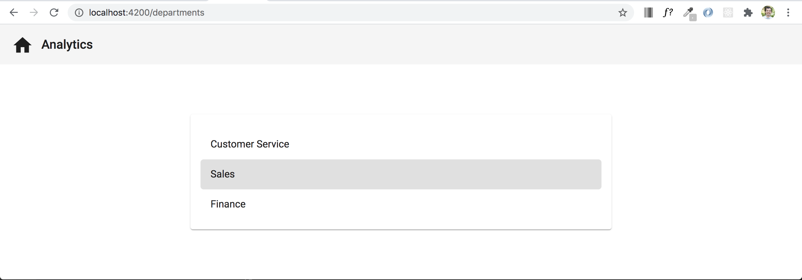
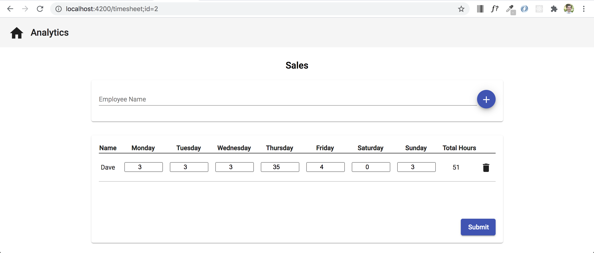
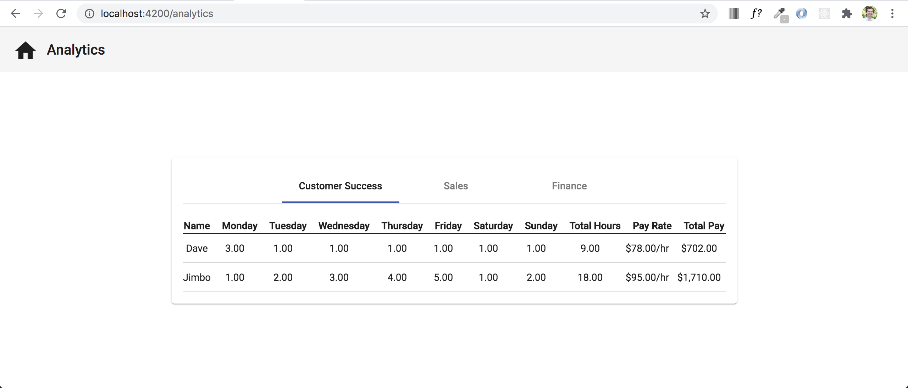
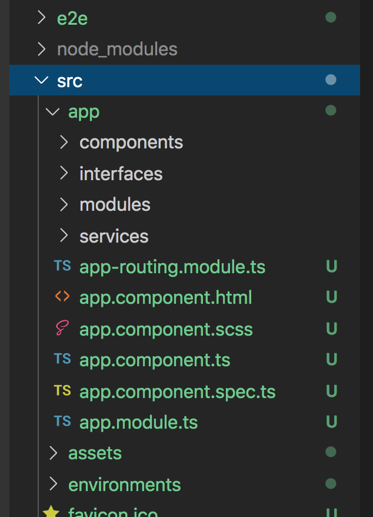
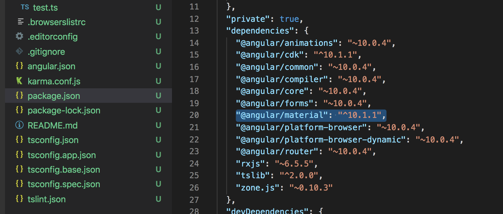
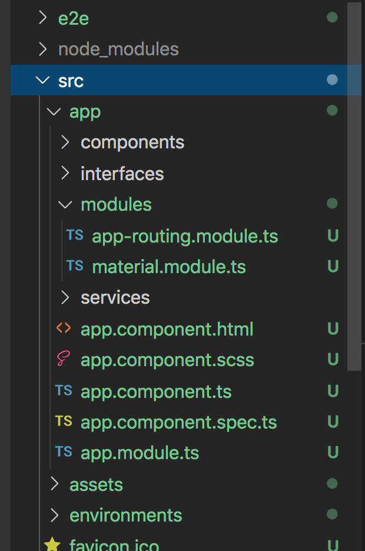

# Application Setup

## Application Introduction
Over the next several days we will be creating an application from scratch that will resemble something that a human resource employee could use to enter the hours for each employee who is working under a certain department. This application will consist of three main pages: a department selection page, a timesheet entry page, and an analysis page.






## Objectives

At the end of this unit, you should be able to answer the following questions:

* What CLI command do I use to start a new Angular application?
* What CLI command do I use to include Angular Material in the application?
* How do I start an Angular application?

## Introduction

Angular is a platform and framework for building single-page client applications using HTML and TypeScript. Angular is written in TypeScript. It implements core and optional functionality as a set of TypeScript libraries that you import into your apps.

## Create a new Angular app

Let's get started with our new application, use the following command to start a new application from scratch.

```
ng new hr-timesheet
```

When asked if you should include routing, type 'y' for yes and press enter
```
Would you like to add Angular routing? (y/N)
```
When asked what stylesheet format you would like to include, select `SCSS`
```
Which stylesheet format would you like to use? (Use arrow keys)
  CSS 
❯ SCSS   [ https://sass-lang.com/documentation/syntax#scss                ] 
  Sass   [ https://sass-lang.com/documentation/syntax#the-indented-syntax ] 
  Less   [ http://lesscss.org                                             ] 
  Stylus [ http://stylus-lang.com  
```

This will create a directory named hr-timesheet, generate all of the app files, and download all of the dependencies specified by the Angular CLI. You're free to install more as your project needs them. The above command may take a minute or more depending on your environment and internet connection speed.

## Create additional directories

Next we will create four additional directories within the `src/app` directory. The four directories will be called `components`, `interfaces`, `modules`, and `services`.



## Add Angular Material

Angular Material is a UI component library for Angular developers. Angular Material components help in constructing attractive, consistent, and functional web pages and web applications while adhering to modern web design principles like browser portability, device independence, and graceful degradation.

To include Angular Material in your application, use the following command:
```
ng add @angular/material
```

When asked what prebuilt theme name to use, stick with `Indigo/Pink`
```Choose a prebuilt theme name, or "custom" for a custom theme: (Use arrow keys)

❯ Indigo/Pink        [ Preview: https://material.angular.io?theme=indigo-pink ] 
  Deep Purple/Amber  [ Preview: https://material.angular.io?theme=deeppurple-amber ] 
  Pink/Blue Grey     [ Preview: https://material.angular.io?theme=pink-bluegrey ] 
  Purple/Green       [ Preview: https://material.angular.io?theme=purple-green ]
 
(Move up and down to reveal more choices)
``` 

When asked if you want to set up global Angular Material typography styles, enter `y` for yes.
```
Set up global Angular Material typography styles? (y/N) 
```

When asked if you want to set up browser animations for Angular Material, enter `Y` for yes.
```
Set up browser animations for Angular Material? (Y/n)
```

By going through this Angular Material setup, you should now have new dependencies installed into your application and your package.json file should be updated to include `@angular/material`.



## Adjust and create modules

Aside from our root `app.module.ts` file, we want to keep all of our other current and future modules in a separate `modules` folder. This will help with organization throughout this application.

The only module file that we currently need to move is our `app.routing.module.ts` file. Move this file into your `modules` directory. If your server is currently running, you will see a whole host of errors. To resolve these errors (do this if you're not seeing errors as well), go to your `app.module.ts` file and update the `AppRoutingModule` import so that the path now shows that the `AppRoutingModule` is located in the `modules` directory:
```
import { AppRoutingModule } from './modules/app-routing.module';
```

The last thing that we will be doing during today's walkthrough of our HR Timesheet app is creating a new module called, AngularMaterial, which will import and export all of the prebuilt Angular components that we will be using throughout our application. To add a new import to your application, use the following CLI command:
```
ng g module modules/material
```

In the command above, the `g` stands for generate. By using that command, we have created a custom module called `material` and stored it within the `modules` directory. The only other step that we want to do here is pull the `material` module out of the nested directory that the CLI command placed it in so that it's now a file by itself on the same level as the `AppRoutingModule`. After moving your `material` module out of the nested directory, your current directory/file structure should look like the image below.



## Acceptance Test

Run the command `ng serve` to ensure that your project will start without errors.
