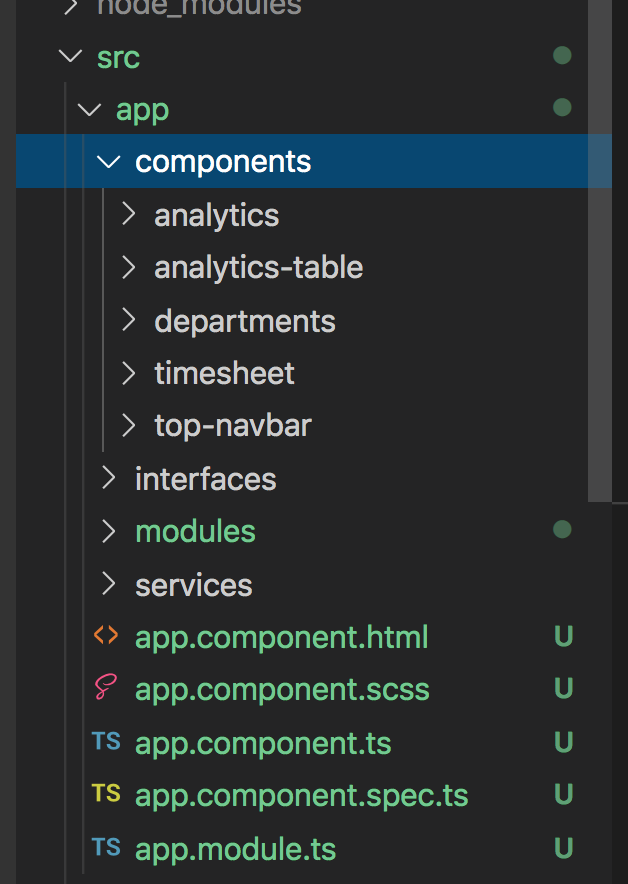

# Component Creation

## Introduction

The HR Timesheet app that we will be creating over the next few weeks will be based around three different pages, a department selection page, a time entry page, and an analytics page. In order for us to have something to display for each route, we first have to create each of the components. Let's use a CLI command to generate the shell of five different components. 

First, create the departments component using the command `ng g c components/departments`.

Second, create the timesheet component using the command `ng g c components/timesheet`.

Third, create the analytics component using the command `ng g c components/analytics`.

We will also want to create a couple other components to help with our user interface.

Create a top-navbar component using the command `ng g c components/top-navbar`.

Create an analytics-table component using the command `ng g c components/analytics-table`.

### Acceptance Test

Your component file structure should look like the image below.

We will add content to the templates of each of these components in later units
