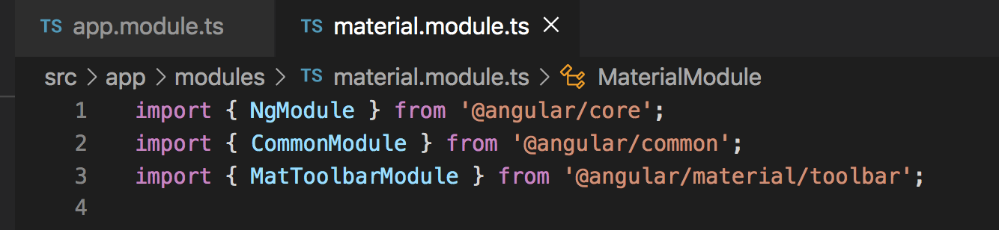
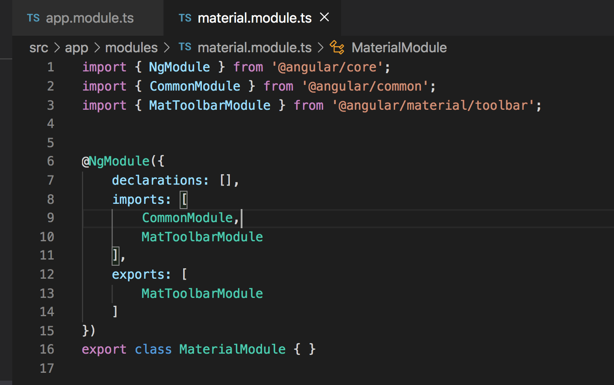
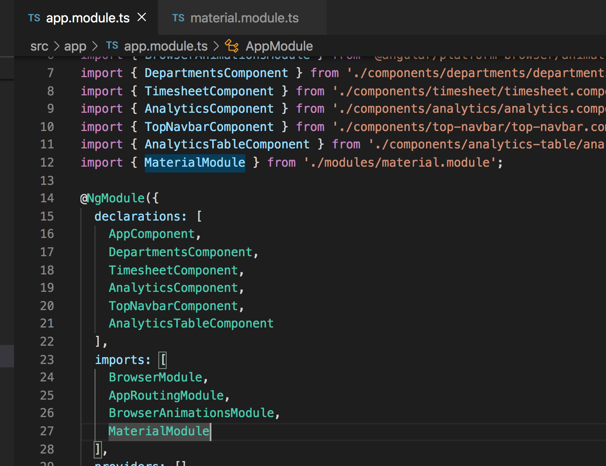

# Component Template

## Introduction

To help with navigation later in our app, we should add a navbar that can always be accessed from the top of the application. During unit-01 we added Angular Material. In today's content, we will make use of Angular Material and use the prebuilt `toolbar` component. In order for us to have access to the `toolbar` component, we must import it into our application, more specifically a module. We will import it into our `angular.module.ts` module.

## Importing MatToolbarModule

Go to `https://material.angular.io/components/toolbar/overview` to see the component that we will be importing into our project. After you have gone to this page, click the `API` tab to have access to the import that we will be using.

Take the `import {MatToolbarModule} from '@angular/material/toolbar';` line from the top of the `API` tab and paste it under the `CommonModule` import at the top of the page. Also paste just `MatToolbarModule` into the `imports` array of the `angular.module.ts` file below the `CommonModule` import.

We need to do a few additional steps to have access to the `toolbar` component.

1. Create a `exports` array below the `imports` array in the `angular.module.ts` file.
2. Paste `MatToolbarModule` into the `exports` array that you just created.

By placing `MatToolbarModule` into the exports array, it allows us to import the `MaterialModule` as a whole into a different module and it will include all of the imports of the `MaterialModule` into the new parent module.

3. The last step we need to do in order to use the `toolbar` component throughout our application is to import the `MaterialModule` into our `AppModule` within the `app.module.ts` file.

To do this, paste `import { MaterialModule } from './modules/material.module';` at the bottom of your imports list at the top of your `app.module.ts` file.

Next, add `MaterialModule` into the `imports` array of your `app.module.ts` file.

Your `app.module.ts` file should look like the image below:

## Acceptance Test

Run `ng serve` to ensure that your application will build without errors.

## Import MatButtonModule and MatIconModule

In our top navbar we will also be including an icon that is placed within a button. In order for us to do that, we will need to follow the same pattern as we did importing the `MatToolBarModule`, but this time we will import both the `MatIconModule` and `MatButtonModule`.

See those imports here:
`https://material.angular.io/components/button/api`
`https://material.angular.io/components/icon/api`

Your `material.module.ts` file should now look like this:
(img/button_icon_imports.png)

