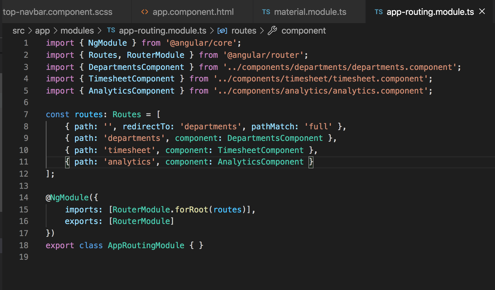
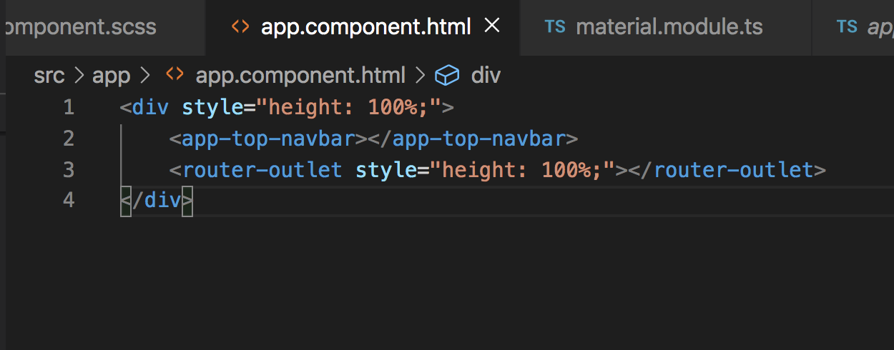
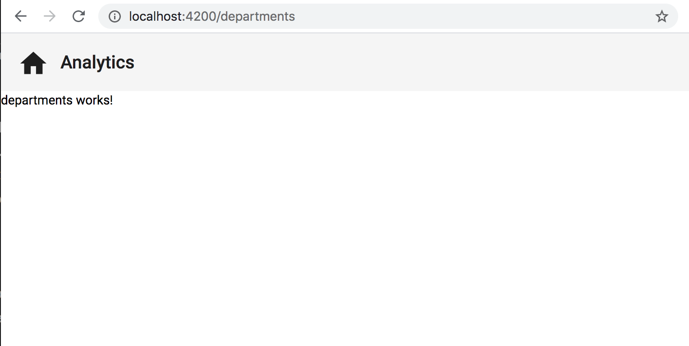

# Routing Basics

## Introduction

The end goal of our application is to have three different viewable pages that we can navigate between. In order for us to do that in the form of a SPA (single page application), Angular provides a RouterModule which allows us view different components as a single page depending on which route we are navigating too. When we initialized our application, we opted to include an `AppRoutingModule`, which you can see in the `app-routing.module.ts` file. This is where we will determine our routes that are attached to certain paths (urls), and which component will be loaded per route.

## Update Routes Array

Go to the `app-routing.module.ts` file, and replace the line where it has 
`const routes: Routes[] = [];`

with
```
const routes: Routes = [
    { path: '',   redirectTo: 'departments', pathMatch: 'full' },
    { path: 'departments', component: DepartmentsComponent },
    { path: 'timesheet', component: TimesheetComponent },
    { path: 'analytics', component: AnalyticsComponent }
];
```



Remember, in the code that we just pasted, `{ path: '',   redirectTo: 'departments', pathMatch: 'full' }` is saying that when we first come to the root path of localhost:4200, we want the user to be redirected to the `departments` path so that the `DepartmentsComponent` will be displayed. All of the other paths will be loaded as we direct the user to them by other ways.

To make it so that the router works, we need to add `<router-outlet style="height: 100%;"></router-outlet>` to the `app.component.html` file.

Your `app.component.html` file should look like the image below.



## Acceptance Test

Start your app up using `ng serve`, go to localhost:4200. You should see that the router redirects you to `localhost:4200/departments` and you should see the basic view as the image below where the main space just shows `departments works!`



## One more thing to add

To be able to see that we are routing between multiple routes, let's add a little bit of code to our HTML so that we can route between the departments page and the analytics page. If you go to the `top-navbar.html` file, let's add a `routerLink`. When a `routerLink` directive is applied to an element in a template, it makes that element a link that initiates navigation to a route.

Overwrite what is currently in the `top-navbar.html` file with
```
<mat-toolbar>
    <button mat-icon-button routerLink="./departments">
        <mat-icon>home</mat-icon>
    </button>

    <div routerLink="./analytics">Analytics</div>
</mat-toolbar>
```

Notice in the above code that we have provided two different `routerLink` directives. One that will navigate us to the `./departments` route, and one that will navigate us to the `./analytics` route. 

Your `top-navbar.html` file should now look like the image below.


## Acceptance Test

If your application is not currently loaded, use `ng serve` to start it. Now to test that the newly added `routerLink` directives are working, click back and forth between the house icon and the `Analytics` word on the top navbar. You should see the text in the main white space switch between `departments works!` and `analytics works!`


