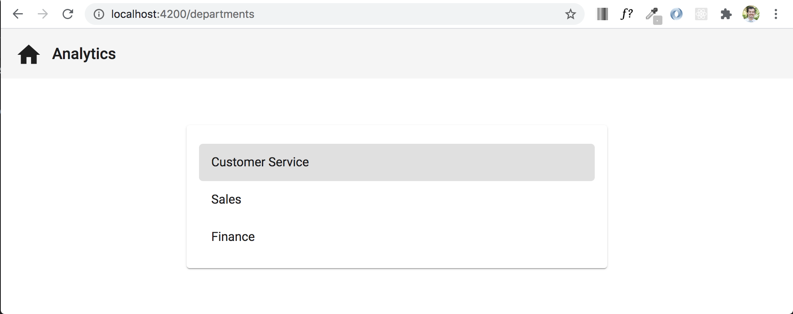
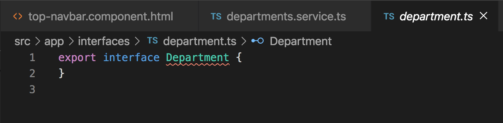
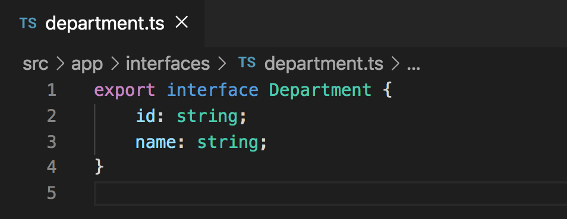
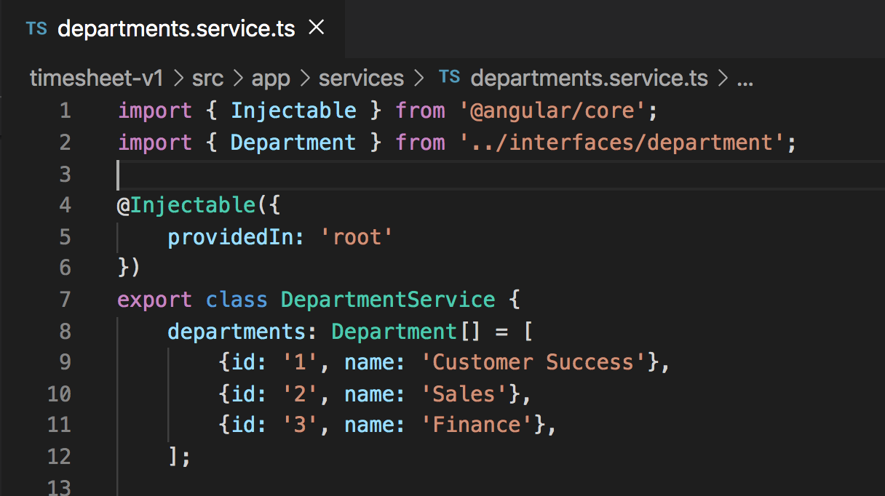

# Service Creation and Data Population

## Introduction

When we finish the departments component, we want it to look like the image below.



To achieve the list of departments like in the image above, we want to retrieve the different department names from a central location that stores all information specific to departments. This would be a great place to utilize a `service`. It would also be a great time to implement service injection within the component that needs access to the list of department names.

Let's create a `departments` service using the CLI. Use the command `ng g s services/departments`. This command will generate a service called `departments` within the `services` folder.


Now that we have a `departments` service created, we will soon want to create a `departments` variable within the departments service and populate it with data that can be accessed from any component that injects the `departments` service into it. We will do this shortly.

Whenever we are creating variables, we want to define the type of that variable using an `interface`. This helps add type safety throughout the application so that we don't have conflicts with the data that we are handling. Let's create an `interface` for a `department`. Use the CLI command `ng g i interfaces/department`, this will create a `department` interface within the `interfaces` folder.

The newly created interface should be mostly empty and should look like the image below.



Let's add properties and define their types within the `department` interface. Overwrite the current code that's in the `department.ts` (interface) file with the code below.

```
export interface Department {
    id: string;
    name: string;
}
```

This defines the properties on the `Department` interface, an `id` property and a `name` property which both have a type of `string`. Your `Department` interface file should now look like this.



Now that we've created the `Department` interface and defined the properties that exist on it, we can create the `departments` variable within the departments service. The variable will be of type `Department` and it will be an array. Your variable with definition should look like `departments: Department[]`. Let's take it one step further and populate it with data. Paste the below code into your `departments.service.ts` file.

```
departments: Department[] = [
    {id: '1', name: 'Customer Success'},
    {id: '2', name: 'Sales'},
    {id: '3', name: 'Finance'},
];
```

Don't forget to import the department interface into the `department.service.ts` file as well. Your `departments.service.ts` file should look like the image below.



## Acceptance Test

Run `ng serve` and make sure that your application start without errors.