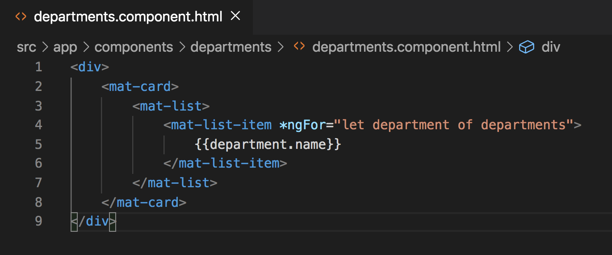

# Department Component Creation and Service Injection

## Introduction

During the previous exercise we created the department service and populated a `departments` variable with seed data. Now that we have access to a departments service and data within it, we can create the departments component that will display the list of departments.


## Inject the Deparments Service

Within the `departments.component.ts` file constructor, let's inject the `DepartmentsService`. The constuctor within the `deparments.component.ts` file should look like the image below. Don't forget to import the `DepartmentsService` at the top of your component.


The next step before we can try and display the departments using HTML would be to create a departments variable within the `deparments.component.ts` file that is set to the same value as the departments variable within the `DeparmentsService`. Follow the next two steps in order.

1. Create the departments variable in the `deparments.component.ts` file. `departments: Department[];`, don't forget the `Department` interface import at the top of your `departments.component.ts` file.


2. Within the `ngOnInit` life cycle hook of the `DepartmentsComponent`, set the `departments` variable equal to the `departments` variable from the `DepartmentsService`.

```
ngOnInit(): void {
    this.departments = this.departmentsService.departments;
}
```


Now that we have set the `departments` variable within the `DepartmentsComponent` we can display each of the departments using HTML. Paste the below code into your `departments.component.html` file.

```
<div>
    <mat-card>
        <mat-list>
            <mat-list-item *ngFor="let department of departments">
                {{department.name}}
            </mat-list-item>
        </mat-list>
    </mat-card>
</div>
```




Run `ng serve` and see if your app runs without errors.

At this point you should see multiple errors logging in your terminal. A couple of them should relate to `mat-card` and `mat-list`. That is because both `mat-card` and `mat-list` are Angular Material components that require imports into our `MaterialModule` module.

Import both `https://material.angular.io/components/card/api` and `https://material.angular.io/components/list/api` into the `material.module.ts` file in the same way that we did the imports for the `mat-toolbar`.

Your `MaterialModule` should look like the image below.


At this point you can restart your server with `ng serve` and you shouldn't see any errors.

There's some styling that we're missing to make it look like the original image at the top of this page. Paste the code below into the `departments.component.scss` file.

```
mat-card {
    width: 50%;
    margin: auto;
}

mat-list-item:hover {
    background-color: #E0E0E0;
    border-radius: 5px;
    cursor: pointer;
}
```


Looking back to the HTML that we pasted in the `departments.component.html`, let's consider what is actually going on here.

```
<div>
    <mat-card>
        <mat-list>
            <mat-list-item *ngFor="let department of departments">
                {{department.name}}
            </mat-list-item>
        </mat-list>
    </mat-card>
</div>
```

Starting from the top down, we've created a parent `div` that is wrapping our main `mat-card`. The `mat-card` gives the appearance of a container that is slightly elevated. Within the `mat-card` we have a `mat-list` that will display the list of departments. To actually display each department individually we are using a `mat-list-item` within the parent `mat-list` element. 

The next key piece of code here is the `*ngFor="let department of departments"`. The `*ngFor` directive allows us to loop through values of an array. The array in this case is the `departments` array from our `departments.component.ts` file that was set using departments from our `DepartmentsService`. 

The `let department` part of `*ngFor="let department of departments"` is setting each interated value of departments to a variable called `department`. With `department` we can use `interpolation` to display the `name` property of the department as you see with `{{department.name}}`.

Finally, we added some styling to the `department.component.scss` file so that the `mat-card` doesn't take the full width of the view, and so that if we hover over a `mat-list-item` that `mat-list-item` appears to be gray.

## Acceptance Test

When you navigate to `localhost:4200/departments` you should see a list of three different departments. If you hover over one of the departments, it should turn gray.