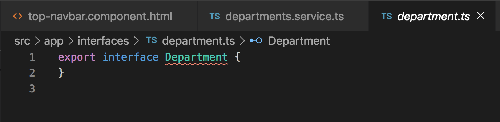

# Service Injection and Departments Component Creation

## Introduction

When we finish the deparments component, we want it to look like the image below.

To achieve the list of departments like in the image above. We want to retrieve the different department names from a central location that stores all information specific to departments. This would be a great place to utilize a service. It would also be a great time to implement service injection within the component that needs access to the list of department names.

Let's create a `departments` service using the CLI. Use the command `ng g s services/departments`. This command will generate a service called `departments` within the `services` folder.

Now that we have a `departments` service created, let's create a `departments` variable and populate it with data that can be accessed from any component that injects the `departments` service into it.

Whenever we are creating variables, we want to define the type of that variable using an `interface`. This helps add type safety throughout the application so that we don't have conflicts with the data that we are handling. Let's create an `interface` for a `department`. Use the CLI command `ng g i interfaces/department`, this will create a `department` interface within the `interfaces folder.

The newly created interface should be mostly empty and should look like the image below.

