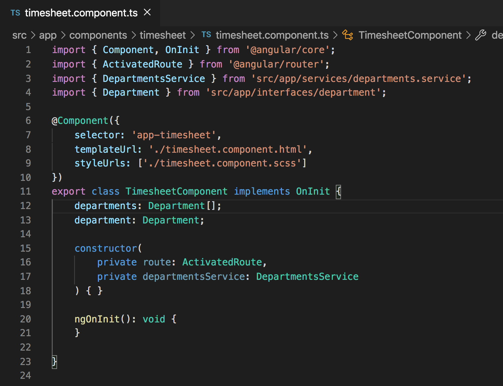

# Additional Routing Techniques

## Introduction
In the previous unit we were able to display the list of departments using `mat-card`, `mat-list`, `*ngFor`, and `{{}}` (interpolation). With that now available, we want to route to a page where we can eventually enter hours for each employee that belongs to the deparment that we clicked on. When we come to the page we clicked on, we want load data that is specific to that department depending on extra information that we will pass to the router.

Let's begin by injecting the `Router` into the constructor of our `DepartmentsComponent`. Don't forget the `import { Router } from '@angular/router';` at the top of the `DepartmentsComponent`.


Next we want to provide a way that we can functionally navigate to a different page by clicking an element in the `departments.component.html` file. Previously we used `routerLink`, but in this case we want to do it through a click event.

In the `departments.component.html` file, add the below code on the same line and directly after the `*ngFor` where we are looping through each department.

`(click)="goToDepartment(department.id)"`


What this provides is a click event for when we click on an individual department. It will call a `goToDepartment()` function and pass in the `id` of the department as a parameter. Now that we have the click event created, we need to actually create the `goToDepartment()` function within our `departments.component.ts` file. Let's do that now. Paste the next code directly below the `ngOnInit` of the `departments.component.ts` file.

```
goToDepartment(departmentId: string): void {
    this.router.navigate(['./timesheet', {id: departmentId}]);
}
```


We now have a `goToDepartment()` function that is called whenever the click event within the `departments.component.html` file is triggered.

Let's dig a little deeper into what `goToDepartment()` is doing. The function requires a single parameter called `departmentId` which is of type `string`. When this function is called, it calls a `navigate` method on the router. The `navigate` method on the router accepts an array of values where the first index is the path that we want to navigate to, and the optional second index is an object where each property represents a path `param` (parameter) that will be attached to the URL that you see in the browser.

## Acceptance Test

Once you have the `goToDepartment()` function and the `(click)` event added to your code, start your app by using `ng serve` and navigate to `localhost:4200`. Click on one of the departments and pay attention to the URL at the top of the page. Do you notice that there is now an `id` param that is attached to the URL?


## Find the department that matches the id param

Sense we now have additional information in the form of a param that is attached to the URL, our next goal is to display the department name associated with that param `id` once we get to the `TimesheetComponent` route. See the next image for what we are trying to accomplish.


The Angular Router provides additional methods and information about a route when we inject `ActivatedRoute` into the constructor of a component. In this case we will be injecting `ActivatedRoute` into the `TimesheetComponent`.

Don't forget the `import { ActivatedRoute } from '@angular/router';` import at the top of the component.


In order for us to display the correct department name at the top of the `timesheet` page, we need to first retrieve the list of departments from our `DepartmentsService` and store them in a variable within our `TimesheetComponent`. With that data we will be able to find the correct department to match the `id` param in the URL.

Inject the `DepartmentsService` into your `TimesheetComponent` constructor and create two variables, a `departments: Department[];` variable and a `department: Department;`. See the image below for what your `timesheet.component.ts` file should currently look like. Don't forget the `DepartmentsService` and `Department` imports at the top of the component.



Next replace the `ngOnInit` code that is within the `timesheet.component.ts` file with the code below.

```
ngOnInit(): void {
    this.departments = this.departmentsService.departments;
    this.department = this.departments.find(department => department.id === this.route.snapshot.params['id']);
}
```


Within the `ngOnInit` we are first setting the `departments` variable equal to the list of departments from our `DepartmentsService`. After we have done that, we perform a `.find()` and look for the department within the `departments` variable where the `id` of the department matches the `id` paramater from the current route. `route` in this case is the `ActivatedRoute` that we injected into the `TimesheetComponent`. On the `ActivatedRoute` we are provided with a `snapshot` that gives us all kinds of information about the current route. We care specifically about the `params` property which holds the `id` that we attached to it from the previous `departments` route. Once the `.find()` method finds the department that has an `id` that matches the activated route `id` param, we set the `department` variable equal to that value.

Once the `department` variable has been set within the `timesheet.component.ts`, we can display information about that department in the `timesheet.component.html` file using interpolation. Let's do that next.

## Acceptance Test

Make sure that when you run `ng serve`, that you don't have any errors up to this point.


## Display Department Depending on Route Param

Paste the below code into your `timesheet.component.html` file.

```
<div class="main-container">
    <div class="cards">
        <h2>{{department.name}}</h2>
    </div>
</div>
```

You should see that when you navigate between clicking a department, the house icon, and a different department, that the title in the view changes.

Let's add a little bit of styling to center the content. Notice that there is a `main-container` class on the parent div. We are going to add styling for that class within the `styles.scss` file. We're doing it in the `styles.scss` file rather than the component file, because we want it to be applied to multiple components.

Add this styling below the `body` styling in the `styles.scss` file.

```
.main-container {
    display: flex;
    align-items: center;
    height: calc(100% - 64px);
}
```


While we're at it, let's add the `main-container` class onto the parent `div` of the `departments.component.html` file as well.


There is one more piece of styling that we need to add to the `timesheet.component.scss` file to get the header to be centered horizontally. Add the style below to the `timesheet.component.scss` file.

```
h2 {
    text-align: center;
}

.cards {
    margin: auto;
}
```


## Acceptance Test

With all of the new styling added, the `departments` and `timesheet` pages should look like the images below.


