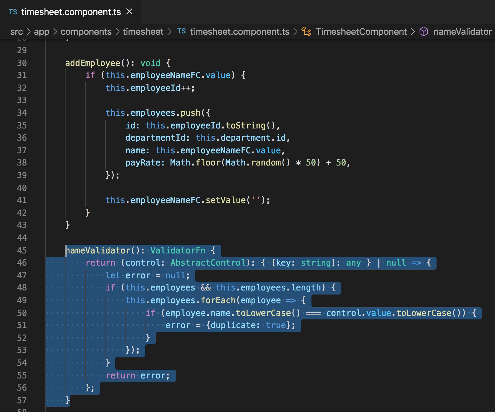
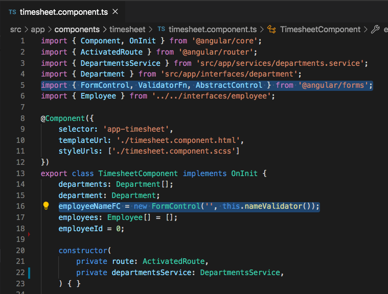
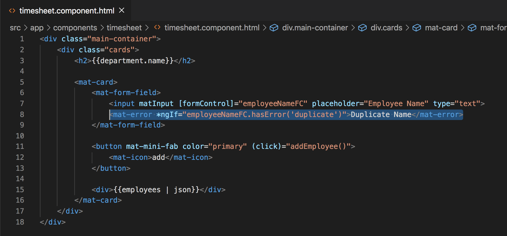
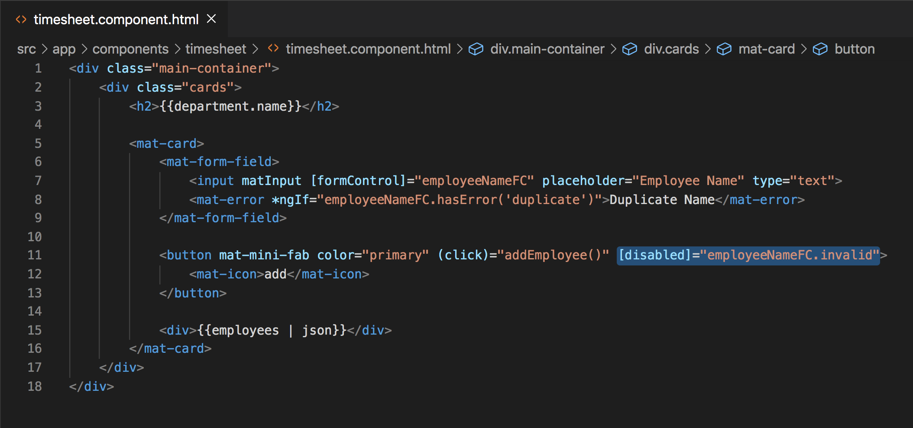

# Reactive Form Control Validation

## Introduction
We've added an input, a button to submit an employee, and can see some data in the UI. Notice that we can enter multiple employee names that are the exact same. Let's work on preventing duplicate employee names from being entered using a form validator.

## Objectives
Using tools that Angular provides, create a custom validator to prevent entering duplicate employee names. The placeholder in red and the error context below the input is what we want to achieve with a custom validator.


Paste the following code below the `addEmployee()` function in the `timesheet.component.ts` file.

```
nameValidator(): ValidatorFn {
    return (control: AbstractControl): { [key: string]: any } | null => {
        let error = null;
        if (this.employees && this.employees.length) {
            this.employees.forEach(employee => {
                if (employee.name.toLowerCase() === control.value.toLowerCase()) {
                    error = {duplicate: true};
                }
            });
        }
        return error;
    };
}
```



You will also need to update the `@angular/forms` import at the top of your `TimesheetComponent` to the code below. This will give us access to everything that we need to create the `nameValidator` function above without errors.

`import { FormControl, ValidatorFn, AbstractControl } from '@angular/forms';`

Now, update the `employeeNameFC` variable to the following code:

`employeeNameFC = new FormControl('', this.nameValidator());`



Lastly, add `<mat-error *ngIf="employeeNameFC.hasError('duplicate')">Duplicate Name</mat-error>` directy below the input element in the `timesheet.component.html` file (keep it within the `mat-form-field`).




Okay, now that we've added some code, let's talk about what's actually happening

1. We replaced `employeeNameFC = new FormControl('');` with `employeeNameFC = new FormControl('', this.nameValidator());`. This will make it so that when we change the value of the input connected to the `employeeNameFC` `formControl`, it will automatically trigger the `nameValidator()` function on every key stroke.

2. When the `nameValidator()` function is triggered, the `control` is automatically passed in as a parameter so that we can get additional information about the input as we need it.

3. On each key stroke, we compare the value on the `control` (input value) against all of the already entered employee names (lower casing both the input and the employee names). If the input value is equal to an employee name that already exists, then we return an object with the property `duplicate: true` to indicate that this is a duplcate name. The `duplicate` property is not Angular specific and could be called anything. If there is no error, then we return null.

4. In the `timesheet.component.html` file, we added a `mat-error` element. The `formControl` class contains a `hasError()` method which returns whether that form control has an error or not of a specific type. In our scenario, we want to display the `Duplicate Name` error only if the input has a duplicate value, so we add an `*ngIf` to display the `mat-error` only if the `employeeNameFC` form control has error of `duplicate`. `*ngIf="employeeNameFC.hasError('duplicate')"`

To finalize this validator so that we can't add an employee if the entered value in the input is a duplicate, add the following code to the button in `timesheet.component.html`. `[disabled]="employeeNameFC.invalid"`




## Acceptance Test

To ensure that our custom validator is actually working, enter an employee name, and then try and enter a second employee with the same name. When you try and do so, there should be a `Duplicate Name` error under the input, and the button to add the employee should be disabled.

