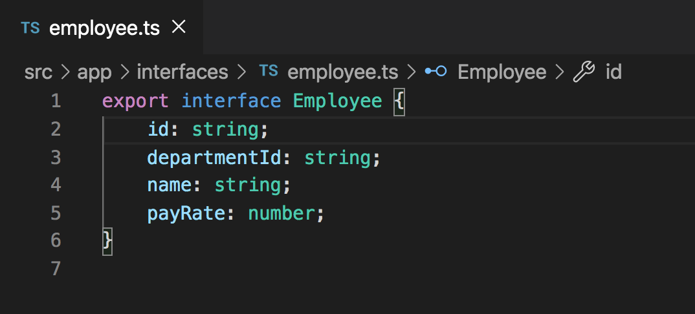

# Reactive Form Control Use

## Introduction
Now that we've done all of the necessary setup to add an input with a reactive form control, let's add some functionality to it.

## Objectives
Our current objective is to add a plus button next to the input so that we can add the employee to a list of employees that will eventually be displayed.

The first thing that we need to do is create an `Employee` interface so that we know what kind of data were handling as our application grows and we are trying to display and work with data that is relevant to an employee.

Use the command `ng g i interfaces/employee`. This will generate an interace using the Angular CLI.

Within that `Employee` interface, add the four property definitions below.

```
id: string;
departmentId: string;
name: string;
payRate: number;
```

We will be adding more properties at a later time, but this is a good starting point.



Now that we have access to an `Employee` interface, let's create two variables in our `timesheet.component.ts` file.

```
employees: Employee[] = [];
employeeId = 0;
```


Soon we will be adding a button to the UI, so that if the user enters an employee name, they can then click a button to submit a new employee. Let's first create the function that will be triggered when the user tries to submit an a new employee.

Go to the `timesheet.component.ts` file and paste the following code below the `ngOnInit`.

```
addEmployee(): void {
    if (this.employeeNameFC.value) {
        this.employeeId++;

        this.employees.push({
            id: this.employeeId.toString(),
            departmentId: this.department.id,
            name: this.employeeNameFC.value,
            payRate: Math.floor(Math.random() * 50) + 50,
        });

        this.employeeNameFC.setValue('');
    }
}
```


In the `addEmployee()` function we are first checking to see if there is actually a value in the input before we do anything. If there's not, then don't do anything. If there is, then first increment the `this.employeeId` variable, this will used as the employees id. Then we are pushing an object with four properties: `id`, `departmentId`, `name`, and `payRate` (value between 50 and 100) to the `this.employees` array. Now that we have the functionality in our `timesheet.component.ts` file to add an employee, let's add some HTML to provide an element for the user to click.

Paste the following code below the `mat-form-field` element in the `timesheet.component.html` file.

```
<button mat-mini-fab color="primary" (click)="addEmployee()">
    <mat-icon>add</mat-icon>
</button>
```


Notice in the code and in the image above that the `button` element that we just added, has a `(click)` event on it. If we click the button the `(click)` event will trigger the `addEmployee()` function from our `timesheet.component.ts` file.

As a temporary way to view the employee information that we are creating, add the following code directly below the `button` we just created in the `timesheet.component.html` file.

`<div>{{employees | json}}</div>`


We will go deeper into Angular Pipes in the future, but all this is doing is taking the `employees` variable and displaying it in `json` form using `|` (pipe).

## Acceptance Test

Start the application using `ng serve`. Select a department and add an employee. You should see data start to populate in the UI.
