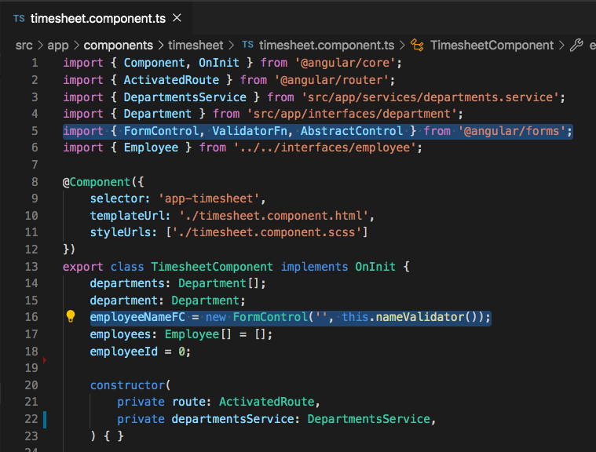

# Reactive Form Control Validation

## Introduction
We've added an input, a button to submit an employee, and can see some data in the UI. Notice that we can enter multiple employee names that are the exact same. Let's work on preventing duplicate employee names from being entered using a form validator.

## Objectives
Using tools that Angular provides, create a custom validator to prevent entering duplicate employee names. The placeholder in red and the error context below the input is what we want to achieve with a custom validator.


Paste the following code below the `addEmployee()` function in the `timesheet.component.ts` file.

```
nameValidator(): ValidatorFn {
    return (control: AbstractControl): { [key: string]: any } | null => {
        let error = null;
        if (this.employees && this.employees.length) {
            this.employees.forEach(employee => {
                if (employee.name.toLowerCase() === control.value.toLowerCase()) {
                    error = {duplicate: true};
                }
            });
        }
        return error;
    };
}
```


You will also need to update the `@angular/forms` import at the top of your `TimesheetComponent` to the code below. This will give us access to everything that we need to create the `nameValidator` function above without errors.

`import { FormControl, ValidatorFn, AbstractControl } from '@angular/forms';`

Lastly, update the `employeeNameFC` variable to the following code:

`employeeNameFC = new FormControl('', this.nameValidator());`




