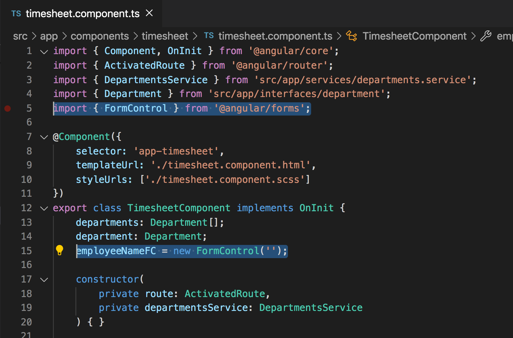
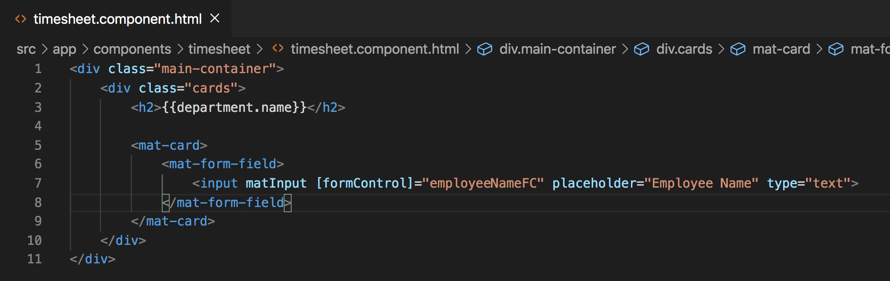
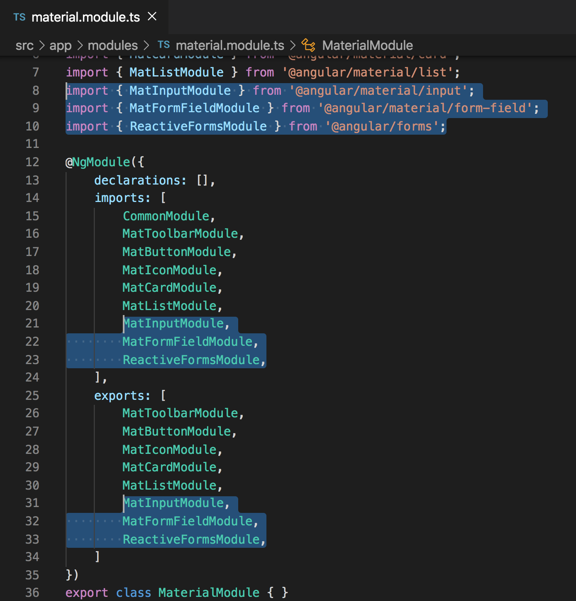
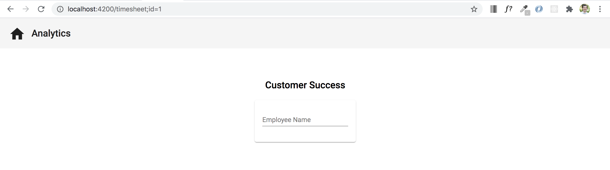

# Reactive Form Controls and Custom Validation

## Introduction
During the creation of this application, we will be using both reactive forms and template driven forms. Today we will be focusing a single input using a reactive form control and how to also apply custom validation on the input.

## Objectives

Our end goal is to have our `./timesheet` (TimesheetComponent) page look like this. Where we have an input to enter a user's name, a plus button to add the user, and then an error under the input if we are trying to enter a name that already exists.


## Add a Reactive Form Control

To start on our path of achieving this goal, go to the `timesheet.component.ts` file and paste this below the `department: Department;` variable.

`employeeNameFC = new FormControl('');`

Also, don't forget to add the `import { FormControl } from '@angular/forms';` at the top of the component.



Next, let's add some html to the `timesheet.component.html` file to give us an input and a button. Paste the following code right below the `h2` element that is already in that file.

```
<mat-card>
    <mat-form-field>
        <input matInput [formControl]="employeeNameFC" placeholder="Employee Name" type="text">
    </mat-form-field>
</mat-card>
```



Looking at the code that we just pasted in, there are a few different things going on here. Within the `mat-card` we first have a `mat-form-field` which is an `Angular` wrapping element to help add styling to the `input` that is contained inside. You'll notice inside of the `mat-form-field` there is an `input`. On that input there is a `matInput` directive to make sure that even though the input is wrapped in a `mat-form-field` that it still has all of the same functionality as a regular `input`.

After the `matInput` directive, you'll see a `[formControl]="employeeNameFC"`. Because the word `formControl` is within `[]`, this means that we are binding `employeeNameFC` to the `formControl` of this input. Remember how we created a `employeeNameFC` variable in our `timesheet.component.ts` file? `[formControl]="employeeNameFC"` is binding the `formControl` property on the input to that `employeeNameFC` instance in our `timesheet.component.ts` file. This will give us additional [reactive] functionality at a later time.

Next we added `placeholder="Employee Name"` to give the input a placeholder, and `type="text"` to define that the value we are entering in this input is expected to be a string and not a number or something different.

## Errors in the console

At this point after we've added our input, you will most likely see errors in your console and that is because we are trying to use Angular components that we haven't included all of the required imports yet. The three imports that we need to add to our `material.module.ts` file are:

```
MatInputModule,
MatFormFieldModule,
ReactiveFormsModule
```

Go ahead and do that now. Add the imports to the top of the file and then also add the module names to the imports and exports arrays.

```
import { MatInputModule } from '@angular/material/input';
import { MatFormFieldModule } from '@angular/material/form-field';
import { ReactiveFormsModule } from '@angular/forms';
```

Your `material.module.ts` file (MaterialModule) should look like the image below. By including these imports, we now have access to the `matInput` directive because of `MatInputModule`, we can use `mat-form-field` in the HTML files because of `MatFormFieldModule`, and we also have access to `[formControl]` because of `ReactiveFormsModule`



## Acceptance Test

Start your app using `ng serve`. Check to see that if you go to a department that you have a card with an input inside.



