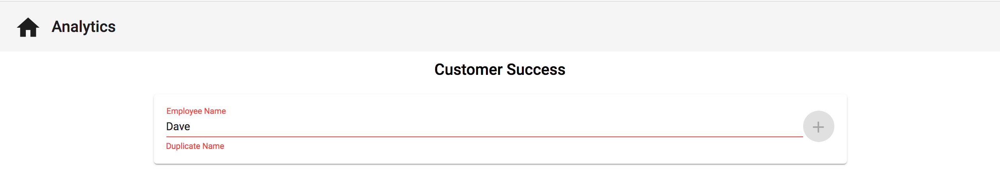

# Reactive Form Controls and Custom Validation

## Introduction
During the creation of this application, we will be using both reactive forms and template driven forms. Today we will be focusing a single input using a reactive form control and how to also apply custom validation on the input.

## Objectives

Our end goal is to have our `./timesheet` (TimesheetComponent) look like this. Where we have an input to enter a user's name, a plus button to add the user, and then an error under the input if we are trying to enter a name that already exists.

