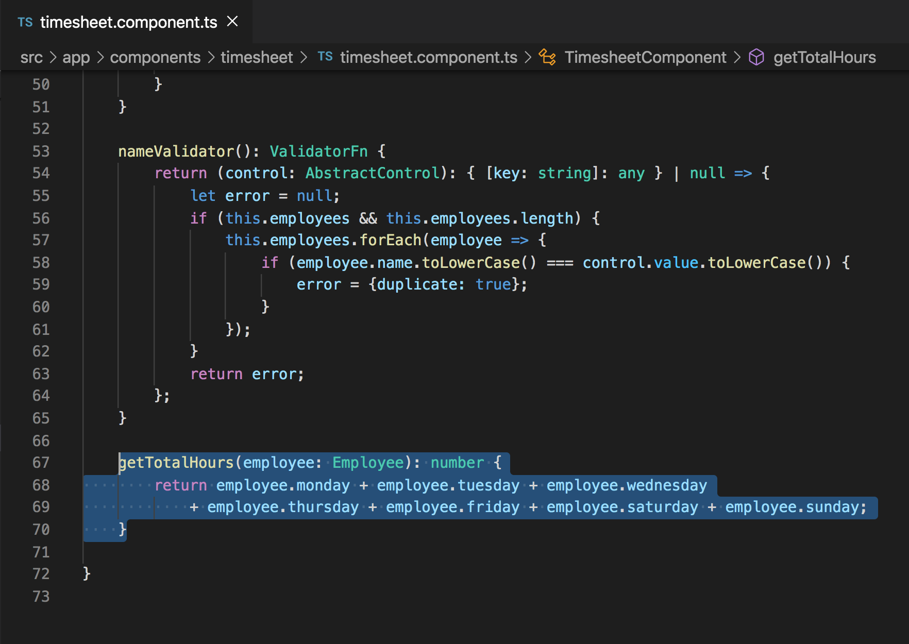
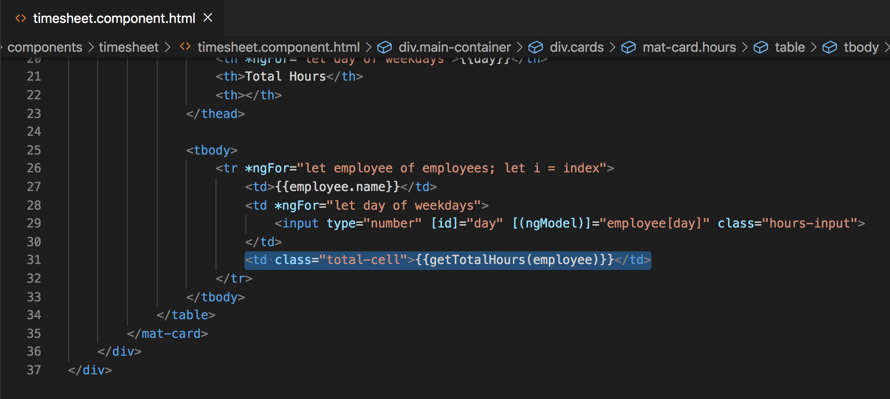
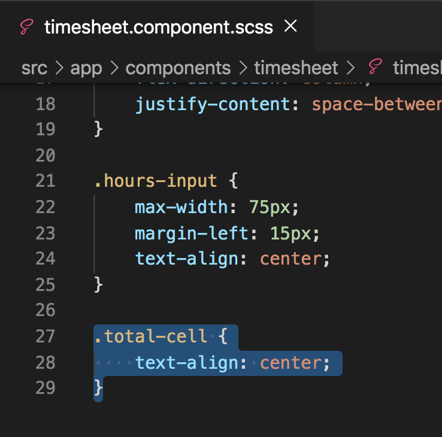
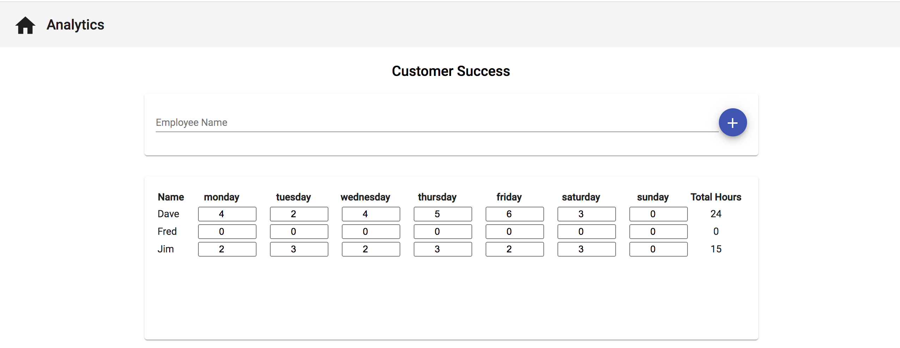
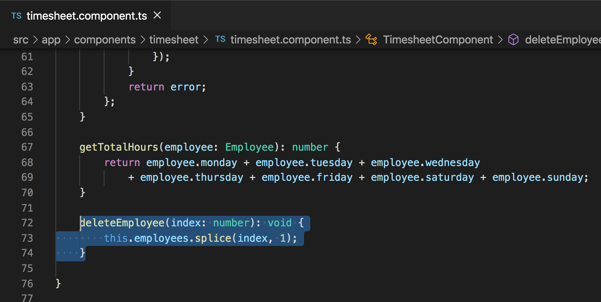
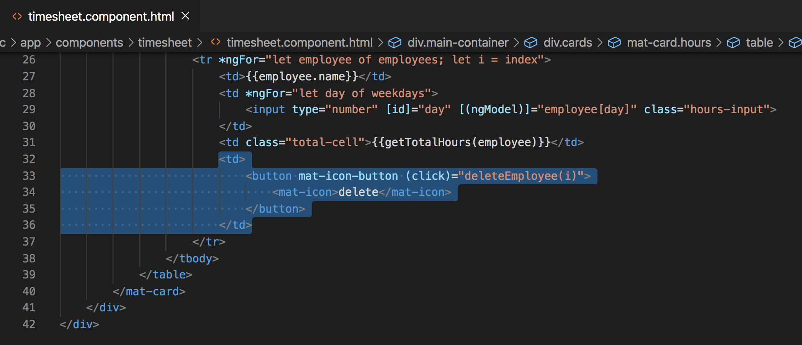
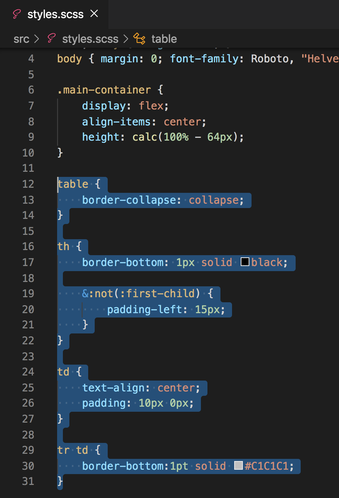
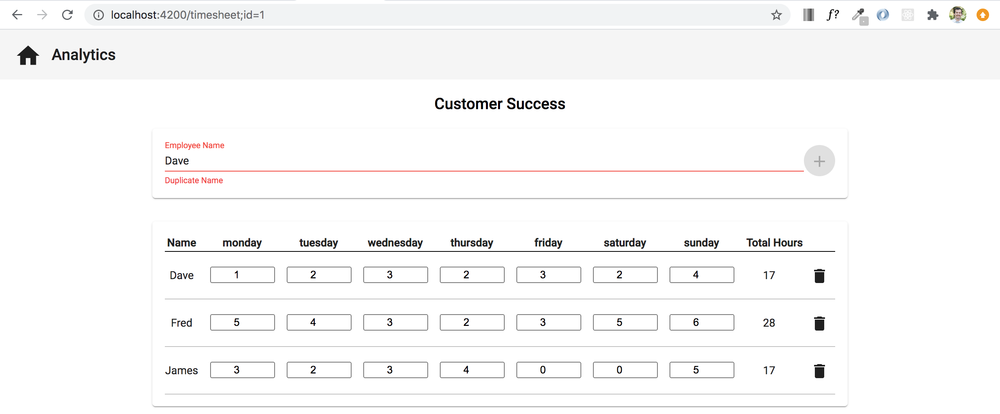

# Totaling Hours and Removing Users

## Objectives
In this section we will be creating a function that allows us to sum the total hours entered for an employee and we will also create the functionality to remove a user that has been added.

## Totaling Hours

First, let's provide a way to total all of the hours entered per employee. In the `timesheet.component.ts` file added the following code below the `nameValidator()` custom validator that we previously created.

```
getTotalHours(employee: Employee): number {
    return employee.monday + employee.tuesday + employee.wednesday
        + employee.thursday + employee.friday + employee.saturday + employee.sunday;
}
```



The above `getTotalHours(employee: Employee)` function that we just created accepts an `employee` parameter which is of type `Employee`. The function will return a value in the form of a `number`. Within the actual function we are summing each day property of the employee and returning the total value.

Let's call this function in our `timesheet.component.html` and display it in the UI.

Add `<td class="total-cell">{{getTotalHours(employee)}}</td>` below the existing `<td>`




Also add the styling below to the `timesheet.component.scss` file to align the input values to the center.

```
.total-cell {
    text-align: center;
}
```



## Acceptance Test

Run `ng serve` to start your server. Once your app is running, add an employee and start typing values into each of the hourly inputs. The `Total Hours` column on the far right should now display the total hours for each employee.




## Removing Users

Now that we have provided a way to total the hours for each employee, let's provide the functionality to remove a user who has been added. In the `timesheet.component.ts` file add the following code below the `getTotalHours()` function.

```
deleteEmployee(index: number): void {
    this.employees.splice(index, 1);
}
```




The `deleteEmployee(index: number)` function accepts an `index` parameter which is of type `number`. With the passed in parameter we will remove the employee from the list of employees (`employees` variable), using `splice`.

To make this function properly, let's add a trash can icon in a new column furthest to the right, so that when the user clicks the icon, the employee is removed.

Add the following html directly below the last existing `<td>` element in the `timesheet.component.html` file.

```
<td>
    <button mat-icon-button (click)="deleteEmployee(i)">
        <mat-icon>delete</mat-icon>
    </button>
</td>
```



To wrap up this section, let's add some styling to `styles.scss` file to add some dividers between rows, underline the headings, and add padding around the cells to help everything look a little bit better.

```
table {
    border-collapse: collapse;
}

th {
    border-bottom: 1px solid black;

    &:not(:first-child) {
        padding-left: 15px;
    }
}

td {
    text-align: center;
    padding: 10px 0px;
}

tr td {
    border-bottom:1pt solid #C1C1C1;
}
```




## Acceptance Test
After adding the trash icon, you should now be able to remove employees after one has been added.


