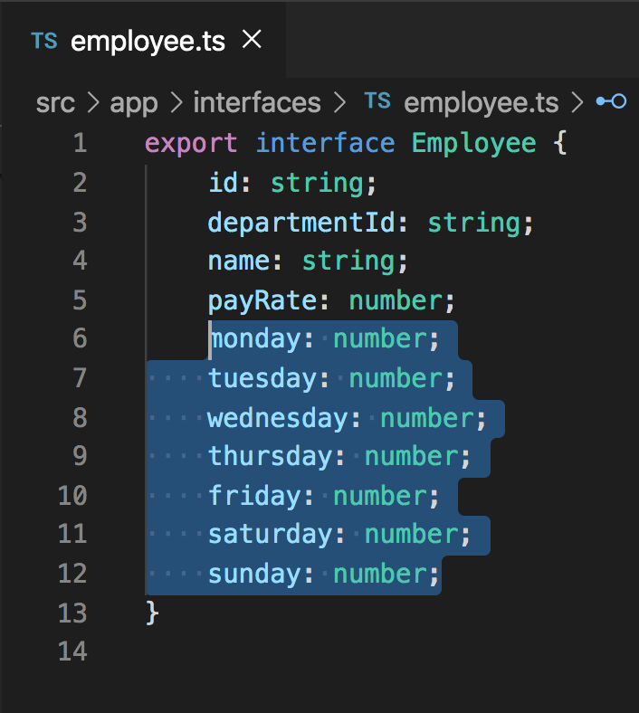

# Template Driven Forms

## Introduction
During the previous exercise, we learned about reactive form controls using `[formControl]`. Today we will learn about template driven forms which is a separate way to track form inputs.

## Objectives
Our current objective will make it so that when the user navigates to the `./timesheet` route, the user is presented with a table that displays the days of the week along with inputs for each day per employee to enter in the amount of hours that each employee worked per day. We will also include a column on the right side of the table that totals employees hours worked during that week. Additionally we will also provide a way to remove an employee.


## Create the Table Headings
First things first, in order for us to display the days of the week at the top as column headings using an `*ngFor` instead of writing them out individually, we'll need to create a `weekdays` variable in the `TimesheetComponent`. Add the next code directly below the `employeeId` variable that we created in the `timesheet.component.ts` file.

`weekdays: string[] = ['monday', 'tuesday', 'wednesday', 'thursday', 'friday', 'saturday', 'sunday'];`


Next, add the following HTML below the current `mat-card` that exists in the `timesheet.component.html` file.

```
<mat-card class="hours">
    <table>
        <thead>
            <th>Name</th>
            <th *ngFor="let day of weekdays">{{day}}</th>
            <th>Total Hours</th>
            <th></th>
        </thead>
    </table>
</mat-card>
```


The above code will create a `mat-card` with the beginning layout for a `table`. It includes a `thead` to show all of the column headings that we will want to show including, `Name`, `Monday`-`Sunday`, `Total Hours`, and a blank heading that will eventually be the column displaying trash can icons to remove users. Notice the `*ngFor="let day of weekdays"` in the second `th` element. This is looping through the `weekdays` variable from our `timesheet.component.ts` file and displaying each weekday.

To add some separation between the two cards that exist in the `TimesheetComponent` and to make sure that the name input takes up more space, add the scss below to the `timesheet.component.scss` file.

```
mat-form-field {
    width: calc(100% - 40px);
}

.hours {
    margin-top: 30px;
}
```


At this point you can remove the `<div>{{employees | json}}</div>` from the `timesheet.component.html`. That line was within the first `mat-card`.

## Acceptance Test

Run `ng serve` and make sure that you see the same thing as the image below when you route to the `./timesheet` page from the departments page.


## Create the Table Body

Now that we have created the headings to our table, our next piece to complete is the body of the table where we display inputs for each employee for each day of the week. Before we get too far into creating the inputs, we're going to alter the `Employee` interface a little bit to help us with some two way binding that we'll be doing shortly.

Add the below properties to the `Employee` interface.

```
monday: number;
tuesday: number;
wednesday: number;
thursday: number;
friday: number;
saturday: number;
sunday: number;
```

The `employee.ts` file (`Employee` interface), should now look like the image below.




