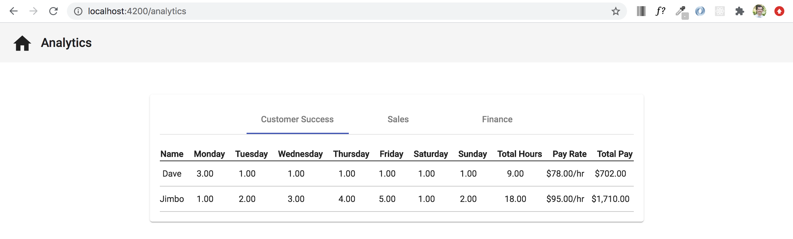

# Nested Components

## Introduction
During previous sections we worked with custom components used primarily as an entire page. We have the `DepartmentsComponent` that displays the list of components and the `TimesheetComponent` that provides a way to enter employee hours. In this section we will implement nesting a smaller component into a parent component.

## Objectives
Nest a component with a parent component. We also want to pass data from the parent component into the child component using `Input()`. We will also incorporate an Angular Material component called `MatTabGroup`. See the image below for an example of what the end result will look like for the analytics page.




## Start MatTabGroup

To make sure that we are in a good starting place, use `ng serve` to start the app and then click on the `Analytics` text on the top toolbar. At this point, all you should see in the main view is text that says, `analytics works!`. If you see anything different or if you see any errors in the console. Go back to a previous section to make sure that you're not missing anything.

Like I mentioned earlier, we will be using an Angular Material component called `MatTabGroup` to help accomplish our objectives in this section. In order for us to have access to `MatTabGroup`, we must first bring in the correct imports like we did with `mat-card`, `mat-toolbar` and other Angular Material components.

Go to the `material.module.ts` file and paste the following code with all of the other imports `import { MatTabsModule } from '@angular/material/tabs';`

After that, paste `MatTabsModule`, into both the `imports` and `exports` arrays within that same file. Your updated `material.module.ts` file should look like the image below.


Within the `analytics.component.html` file, paste the following code. This should now be the only code in that file.

```
<div class="main-container">
    <mat-card>
        <mat-tab-group mat-align-tabs="center">
            <mat-tab label="Customer Success"></mat-tab>
            <mat-tab label="Sales"></mat-tab>
            <mat-tab label="Finance"></mat-tab>
        </mat-tab-group>
    </mat-card>
</div>
```


Within the `analytics.component.scss` file, paste the following code.

```
mat-card {
    margin: auto;
}
```


Referring back to the html that we just pasted, we added a parent `<div>` that contains a `<mat-card>`. Within the `<mat-card>` we have our new Angular Material `<mat-tab-group>`. To give us the option to alternate between each of the three departments, we've placed three `<mat-tab>` elements inside of the `<mat-tab-group>`, giving each `<mat-tab>` a separate label to help differentiate between the `Customer Success`, `Sales`, and `Finance` departments.

The styling that we added centers the `<mat-card>` in the center of the page.


## Acceptance Test

At this point you should be able to restart your serve and navigate to the `./analytics` route by clicking on the `Analytics` text on the top navbar. Once there, you should be able to click on each of the three different tabs and see the focus change from one tab to the other as you click different departments.


## Use Selector of Nested Component

We are making good progress so far having setup our basic `MatTabGroup`. Now we want to populate each `MatTab` with data depending on which department has been clicked. To help us display content, we will first add two variables `employees` and `employeeData`. `employeeData` will be some static data that we will temporarily use in `analytics-table.component.ts` file. Above the `constructor`, add the following code.

```
employees: Employee[] = [];
employeeData: Employee[] = [
    {
        departmentId: '1',
        friday: 6,
        id: '1',
        monday: 4,
        name: 'a',
        payRate: 70,
        saturday: 7,
        sunday: 6,
        thursday: 5,
        tuesday: 3,
        wednesday: 4
    },
    {
        departmentId: '1',
        friday: 2,
        id: '2',
        monday: 4,
        name: 'b',
        payRate: 63,
        saturday: 1,
        sunday: 2,
        thursday: 3,
        tuesday: 3,
        wednesday: 4
    },
    {
        departmentId: '2',
        friday: 9,
        id: '3',
        monday: 8,
        name: 'c',
        payRate: 76,
        saturday: 7,
        sunday: 5,
        thursday: 4,
        tuesday: 7,
        wednesday: 5
    },
    {
        departmentId: '3',
        friday: 2,
        id: '4',
        monday: 3,
        name: 'd',
        payRate: 56,
        saturday: 3,
        sunday: 2,
        thursday: 0,
        tuesday: 4,
        wednesday: 5
    }
];
```

Don't forget to also add the `Employee` interface import at the top of the file as well. `import { Employee } from 'src/app/interfaces/employee';`. Eventually this data will be replaced with data from a database, but this will give us some test data to work with.


Next we want to add html to the `analytics.component.html` file so that we can start to see changes in the user interface. Replace what is currently in `analytics.component.html` with the following code.

```
<div class="main-container">
    <mat-card>
        <mat-tab-group mat-align-tabs="center">
            <mat-tab label="Customer Success">
                <app-analytics-table></app-analytics-table>
            </mat-tab>
            <mat-tab label="Sales">
                <app-analytics-table></app-analytics-table>
            </mat-tab>
            <mat-tab label="Finance">
                <app-analytics-table></app-analytics-table>
            </mat-tab>
        </mat-tab-group>
    </mat-card>
</div>
```


Notice the highlighted changes in the image above. We added `<app-analytics-table></app-analytics-table>` into each of the three `<mat-tab>` elements. By placing the `app-analytics-table` selector (found in the `@Component` decorator) of the `AnalyticsTableComponent` as an element within the html of `AnalyticsComponent`, the `AnalyticsTableComponent` has now become a child (nested) component to the parent `AnalyticsComponent`.


## Acceptance Test

Your `./analytics` page should now look similar to the image below.


## Display a within each tab

In the `analytics-table.component.ts` file paste the following `weekdays` variable directly above the `employees` variable that already exists in there. `weekdays: string[] = ['monday', 'tuesday', 'wednesday', 'thursday', 'friday', 'saturday', 'sunday'];`. This will give us a variable that we can loop through with an `*ngFor` to display each day as a header in a table we will be creating.


To start on creating that table that will b


