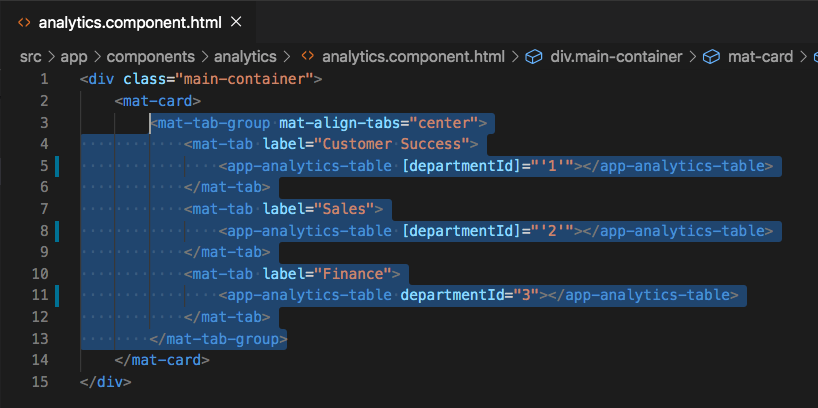
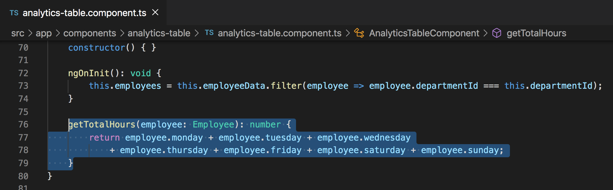
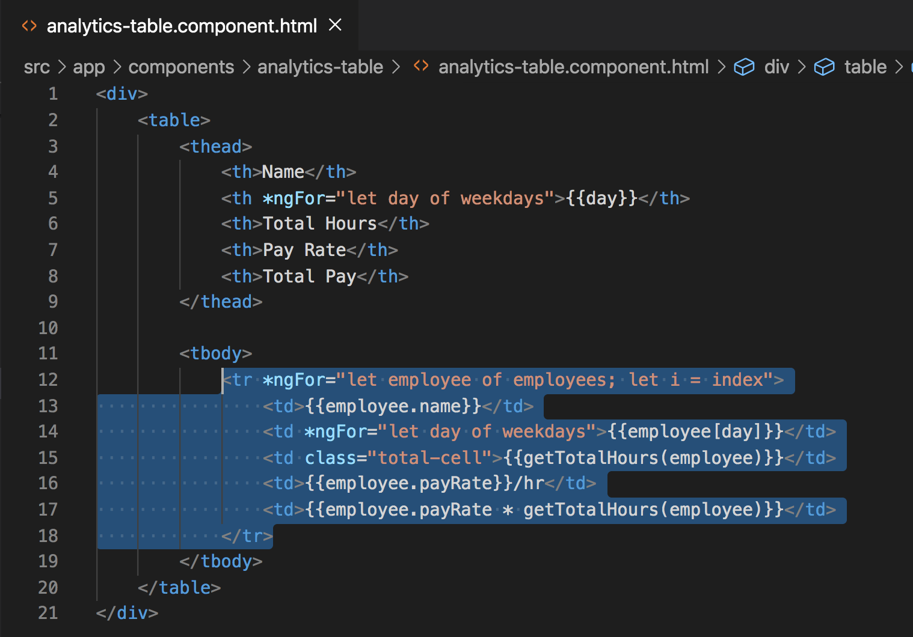
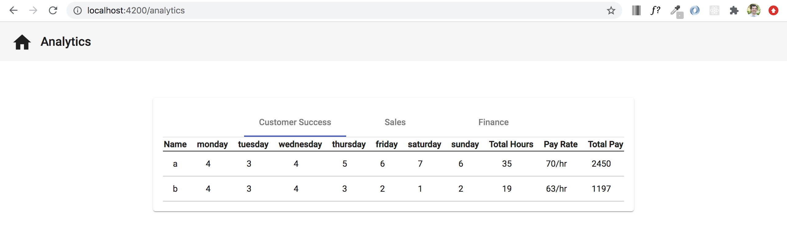

# Nested Table Creation

## Introduction

We've now gotten to the point where we have a component nested within a parent component. When we click on each of the tabs, we all we see is `analytics-table works!`. We want to now switch out that text with a table to display information about each of the employees.


To get this going, copy the following html into the `analytics-table.component.html` file. This should be the only html in that file.

```
<div>
    <table>
        <thead>
            <th>Name</th>
            <th *ngFor="let day of weekdays">{{day}}</th>
            <th>Total Hours</th>
            <th>Pay Rate</th>
            <th>Total Pay</th>
        </thead>
    
        <tbody>
            <tr *ngFor="let employee of employees; let i = index">
                <td>{{employee.name}}</td>
                <td *ngFor="let day of weekdays">{{employee[day]}}</td>
                <td class="total-cell"></td>
                <td>{{employee.payRate}}/hr</td>
                <td></td>
            </tr>
        </tbody>
    </table>
</div>
```


As you're looking at the code, it should look pretty familiar to other code that we've written, and that's because it is. This is resembling the code that we used in the `TimesheeComponent`, execpt this time we won't be using inputs, we'll just be displaying data that has already been created.

## Acceptance Test

At this point you should be able to go to the `./analytics` route and see the same thing as the image below. Test it out now.


## Diplaying the correct data

At this point you may be seeing that we have an `employees: Employee[]` variable and we're looping through that variable within the `analytics-table.component.html` file, but how do we get that populated correctly according to the current department tab that we're on?

This is where the combination of property binding and the `@Input()` decorator come into play. We have three piece of code that we need to add next to display the correct employees. Do it in this order following order. See the images after the three steps to make sure you have everything correct.

1. Add an `Input()` decorator in the `analytics-table.component.ts` file to create a variable that will accept the current department id.

```
@Input()
departmentId: string;
```

2. Bind the current department id from the parent `AnalyticsComponent` into the `AnalyticsTableComponent`. Replace the `mat-tab-group` code that is currently in the `analytics.component.html` file with the code below.

```
<mat-tab-group mat-align-tabs="center">
    <mat-tab label="Customer Success">
        <app-analytics-table [departmentId]="'1'"></app-analytics-table>
    </mat-tab>
    <mat-tab label="Sales">
        <app-analytics-table [departmentId]="'2'"></app-analytics-table>
    </mat-tab>
    <mat-tab label="Finance">
        <app-analytics-table departmentId="3"></app-analytics-table>
    </mat-tab>
</mat-tab-group>
```

3. Set the `employees` variable in `analytics-table.component.ts` file equal to the employees from the `employeeData` variable that have the department id that is currently being passed to the `departmentId` `@Input()` within the `ngOnInit()`.


```
ngOnInit(): void {
    this.employees = this.employeeData.filter(employee => employee.departmentId === this.departmentId);
}
```





## Acceptance Test

Navigate to the `./analytics` route and the page should look like the image below when the `Customer Success` tab is selected.


## Diplaying Total Hours and Total Pay

We are displaying almost all of the data that we need in the table. The two values that we are missing for each employee is the `Total Hours` and `Total Pay`. In order for us to display that data, we will have to create a function that can calculate the total hours depending on the employee that we pass in as a parameter. Copy the function below into the `analytics-table.componet.ts` file under the `ngOnInit()`.

```
getTotalHours(employee: Employee): number {
    return employee.monday + employee.tuesday + employee.wednesday
        + employee.thursday + employee.friday + employee.saturday + employee.sunday;
}
```



Next, let's use this function in the `analytics-table.component.html` file to help us display the employee's total hours and total pay.

Replace the existing `<tr>` element and all of the `<td>` elements inside of it with the code below.

```
<tr *ngFor="let employee of employees; let i = index">
    <td>{{employee.name}}</td>
    <td *ngFor="let day of weekdays">{{employee[day]}}</td>
    <td class="total-cell">{{getTotalHours(employee)}}</td>
    <td>{{employee.payRate}}/hr</td>
    <td>{{employee.payRate * getTotalHours(employee)}}</td>
</tr>
```



Notice that we over wrote the whole `<tr>` section of code that was previously there (for ease of pasting), but the only real changes that were made are to lines 15 and 17 where we are actually using the `getTotalHours()` to display the total hours worked to and calculate the total pay by multiplying the employee's pay rate by the total hours the employee worked.


## Acceptance Test

Navigate to the `./analytics` route and the page should look like the image below when the `Customer Success` tab is selected. The table should now include the employee `Total Hours` and `Total Pay` data.




