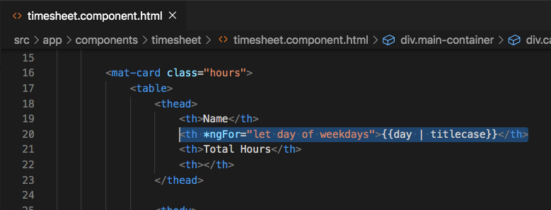
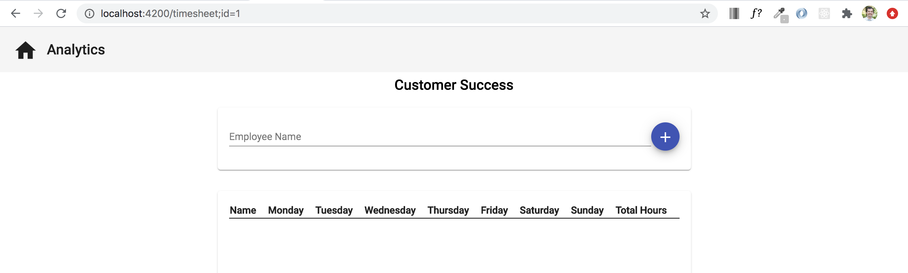
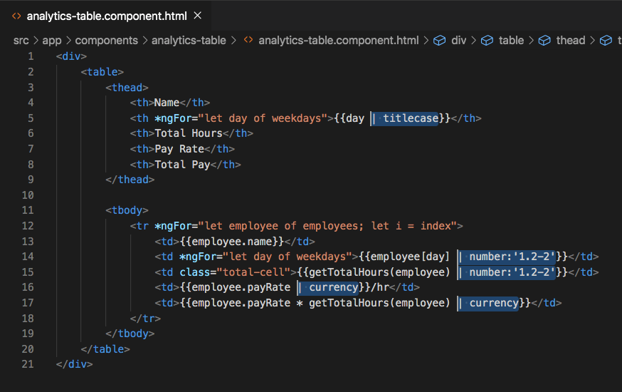
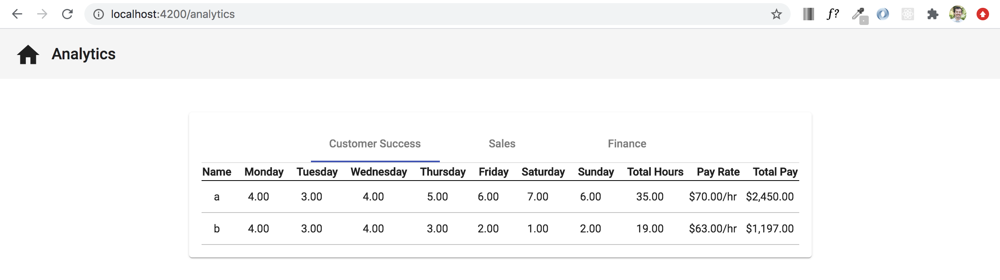

# Angular Pipes

## Introduction

During the previous section, we created a nested component that displayed a table relating to employee data. In that table, we display table headers that could be capitalized, numbers that could have decimals, and money amounts that would be more recognizeable with dollar signs placed in front of them. Angular provides `pipes` (`|`) that help us better display or handle our data. During this section we will be implementing a few of these pipes.

Check out `https://angular.io/api?type=pipe` to see some of the most commonly used pipes.


## Objectives

Our goal is to use the `titlecase`, `number`, and `currency` pipes in our application.


## Apply pipe to TimesheetComponent

In the `timesheet.component.html` file where we are using an `*ngFor` to loop through the days of the week, add `| titlecase` within the interpolation, but after the word `day`. That `<th>` element should now look like `<th *ngFor="let day of weekdays">{{day | titlecase}}</th>`




## Acceptance Test

To test that the `titlecase` pipe is working correctly, go to the `./timesheet` route and looking at each of the table headers. They should all have the first letter capitalized now.




## Apply pipes to AnalyticsTableComponent

Next, we will do something similar to the `analytics-table.component.html` file, but also add a couple other pipes as well.

For simplicity purposes, overwrite what is currently in the `analytics-table.component.html` with the code below.

```
<div>
    <table>
        <thead>
            <th>Name</th>
            <th *ngFor="let day of weekdays">{{day | titlecase}}</th>
            <th>Total Hours</th>
            <th>Pay Rate</th>
            <th>Total Pay</th>
        </thead>
    
        <tbody>
            <tr *ngFor="let employee of employees; let i = index">
                <td>{{employee.name}}</td>
                <td *ngFor="let day of weekdays">{{employee[day] | number:'1.2-2'}}</td>
                <td class="total-cell">{{getTotalHours(employee) | number:'1.2-2'}}</td>
                <td>{{employee.payRate | currency}}/hr</td>
                <td>{{employee.payRate * getTotalHours(employee) | currency}}</td>
            </tr>
        </tbody>
    </table>
</div>
```




Notice in the image above how there are five different places where `pipes` are highlighted. The first instance is the `titlecase` pipe where we are capitalizing the first character of each weekday header. The second and third instances are using the `number` pipe. This allows us to set a default number of decimals to follow the integer value. In our case we are always displaying two decimal places. The fourth and fifth instances are using the `currency` pipe. This places a `$` to the left of the value and also adds two decimal places as well.


## Acceptance Test

To test that your pipes are working correctly, start your server again if it isn't already running, using `ng serve`, then click the `Analytics` text on the top navbar. When the `Customer Success` tab is selected, your data should look the same as the image below.




## Bonus

Remember in the `TimesheetComponent` when we needed a quick way to display employee information after we added each employee? We used a `| json` pipe to display that data without having to use an `*ngFor` to loop and display content. For the majority of cases you wouldn't be using `| json` to display content in the UI, but it's good to know that it exists for quick data checking.


