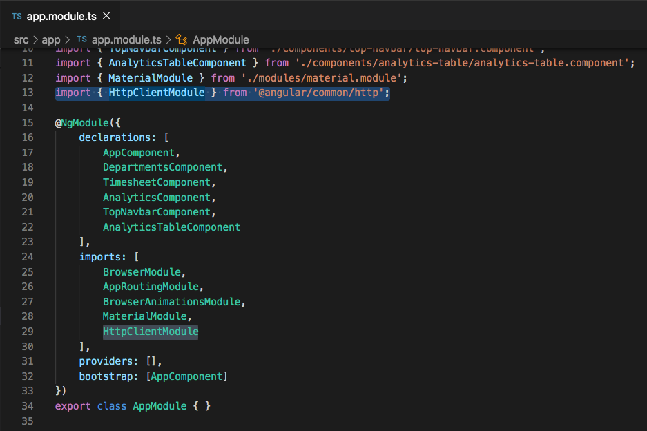
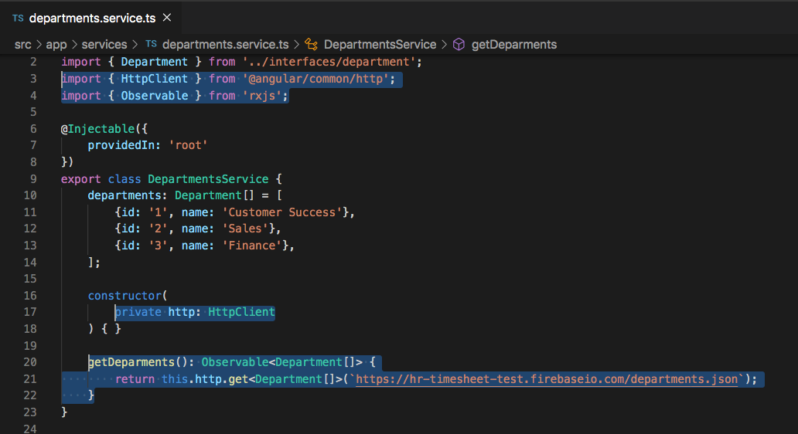
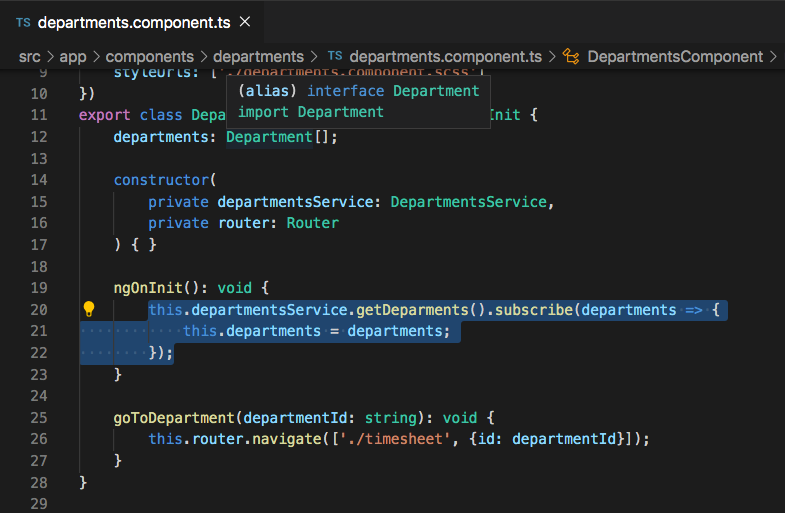

# Using HTTP

## Introduction

When we first created the `DeparmentsComponent` we retrieved a list of static departments from a `DepartmentsService`. To alter our code so that it is more realistic, we're going to update the `DepartmentsService` so that we can call a `getDepartments()` function, which will make an `http` request to a database that will then return a list of departments.


## Import HttpClientModule

In order for us to make an `http` request in our Angular application, we must first import the `HttpClientModule` into our `app.module.ts` file. Let's do that now.

Make sure the `import { HttpClientModule } from '@angular/common/http';` is at the top of the `app.module.ts` file, and also include `HttpClientModule` at the bottom of the `imports` array within that file.




Now that we have imported the `HttpClientModule` into our application, we can refactor our `DepartmentsService` to retrieve the departments using an `http` call.

Go to the `department.service.ts` file and inject `HttpClient` into the constructor. Don't forget to import `HttpClient` at the top of the service.

`import { HttpClient } from '@angular/common/http';`

```
constructor(
    private http: HttpClient
) {}
```

While we're still in that service, add the `getDepartments()` function code below. You will also need to import the `Observable` type from `import { Observable } from 'rxjs';` to make this fully work.

```
getDeparments(): Observable<Department[]> {
    return this.http.get<Department[]>(`https://hr-timesheet-test.firebaseio.com/departments.json`);
}
```




The `getDepartments()` function that we just created returns an `Observable` containing a list of `Deparments`. To make the request to get data, we have to call `this.http` which is the injected `HttpClient` in the constructor, and we call the `get()` method on that module to define it as a `get` request rather than a `post` or `delete` request. We also pass in `https://hr-timesheet-test.firebaseio.com/departments.json` to the `get()` request to define the location that we are retrieving data from.

To see this in action, let's update our `departments.component.ts` file to retrieve departments using this new `getDepartments()` function.

Within the `departments.component.ts` file, replace the `this.departments = this.departmentsService.departments;` line with the following code.

```
this.departmentsService.getDeparments().subscribe(departments => {
    this.departments = departments;
});
```


