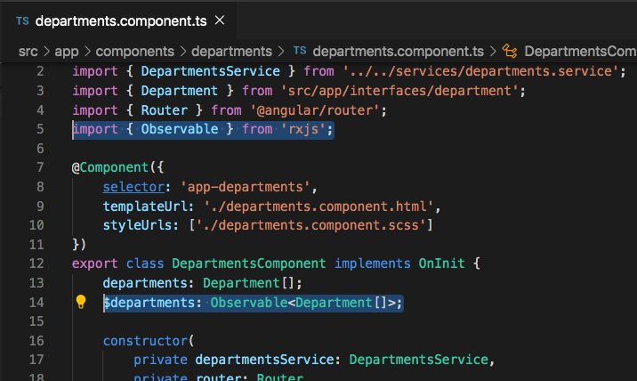
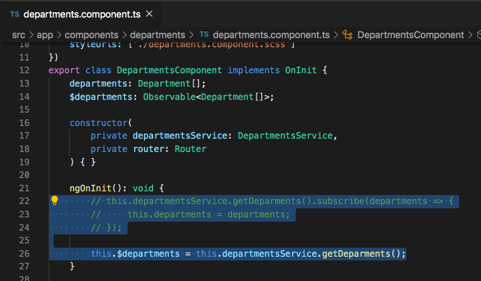
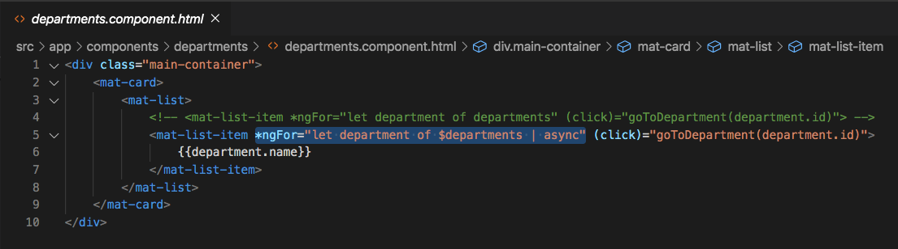

# Using HttpClientModule

## Introduction

In the previous section we swapped out the static list of departments that we had set in the `DepartmentsService` for an http call that retrieved the data from a database.

Once we called the `getDepartments()` function, we used `.subsribe()` to subsribe to the `Observable` and set `this.departments` equal to the value returned in the `.subscribe()`. Today we are going to show you another way that you can display data from an observable in the html directly without having to set any variables in a typescript file.


## Using the Async Pipe
Just so that you can easily spot the differences between the old code that subscribed `getDepartments()` observable, and the new code that uses an `async` pipe, we will only comment out the old code instead of overwriting it.

In the `departments.component.ts` file, paste the following code below the old `departments: Department[];` variable.

`$departments: Observable<Department[]>;`

Also, don't forget the `Observable` import at the top of the page. `import { Observable } from 'rxjs';`





Look closely at the variable that we just created. We have prefixed the variable name with a `$`. This doesn't give the variable any additional properties or methods, but it is common practice to prefix a variable name with a `$` if the variable is storing an observable. And in this case it is storing an observable of type `Department[]`.

In the `ngOnInit` of the same file, below the previous code that we subscribed to the `getDepartments()`, paste the following code.

`this.$departments = this.departmentsService.getDeparments();`

You can also now comment out the previous subscription code.





Now go to the `departments.component.html` file and replace all of the html with the html below.

```
<div class="main-container">
    <mat-card>
        <mat-list>
            <!-- <mat-list-item *ngFor="let department of departments" (click)="goToDepartment(department.id)"> -->
            <mat-list-item *ngFor="let department of $departments | async" (click)="goToDepartment(department.id)">
                {{department.name}}
            </mat-list-item>
        </mat-list>
    </mat-card>
</div>
```



We have now commented out the previous opening `mat-list-item` tag and replaced it with an updated tag that incorporates the new `async` pipe. Looks closely at the updated `*ngFor` loop. we have replaced the old `departments` variable with the new `$departments` variable, and also added an `| async` pipe. Using the `async` pipe allows us to subcribe directly to the `$departments` observable within the html and loop through the array values as if it were a regular variable holding an array.


## Acceptance Test

Go to the `./departments` page and make sure that you are still able to see the list of departments after refactoring the code to use an `async` pipe.

