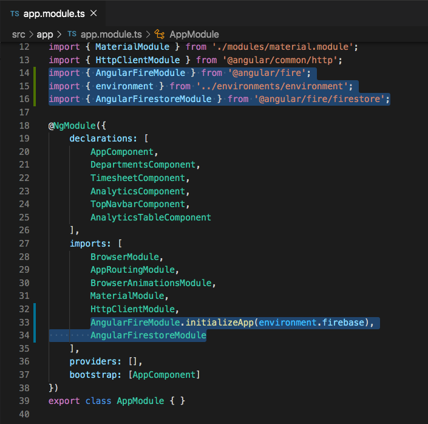

# Firebase Setup

## Introduction

At this point in our application when we go to enter the hours each employee worked, the data isn't saved anywhere. If we leave the page or refresh the app, the data is lost forever. In this section we will be implementing Angular Firestore and saving to Firebase.


## Intalling Firebase Into Our Application

In order for our application to have access to all of the firebase methods and types, we must install Firebase into our application. Use the following code to install 1) Firebase as well as the 2) Angular Firebase library which will allow us to use code that is more closely tied to Angular.

`npm install firebase @angular/fire --save`


Now that we've installed `firebase` and `@angular/fire` into the application, go ahead and create a new firebase project from the firebase console, and initialize a Cloud Firestore database (not realtime database). If you don't remember how, follow the previous configuration steps that we used here https://github.com/MountainlandWEB/angular/blob/master/lessons/day-17-firebase-and-angularfire-intro/unit-01-introduction-to-firebase.md

Go to the settings of the firebase application that you just setup and look for the `firebaseConfig` object. Once you have found that, paste it into your `environment.ts` file. The code in your `environment.ts` file should now look like the code below except that all of `<something goes here>` references should have the actual values from your firebase config.

```
export const environment = {
  production: false,
  firebase: {
    apiKey: '<apiKey goes here>',
    authDomain: '<authDomain goes here>',
    databaseURL: '<databaseURL goes here>',
    projectId: '<projectId goes here>',
    storageBucket: '<storageBucket goes here>',
    messagingSenderId: '<messagingSenderId goes here>',
    appId: '<appId goes here>',
    measurementId: '<measurementId goes here>'
  },
};
```

To load these properties to your Angular app, you will need to add the `AngularFireModule` to the `imports` array of your app module, call its `initializeApp()` method, and pass in the firebase properties. Along with add that code, we will also import the `AngularFirestoreModule as well.

Add these to the imports at the top of the `app.module.ts` file

```
import { AngularFireModule } from '@angular/fire';
import { environment } from '../environments/environment';
import { AngularFirestoreModule } from '@angular/fire/firestore';
```

Add these two lines to the bottom of the actual `imports` array in the `app.module.ts` file.

```
AngularFireModule.initializeApp(environment.firebase),
AngularFirestoreModule
```


Your `app.module.ts` file should look like the image below. The highlighed lines are the line of code that we just added.




## Acceptance Test

Use `ng serve` to make sure that your application will start successfully with the imports that we have just added.