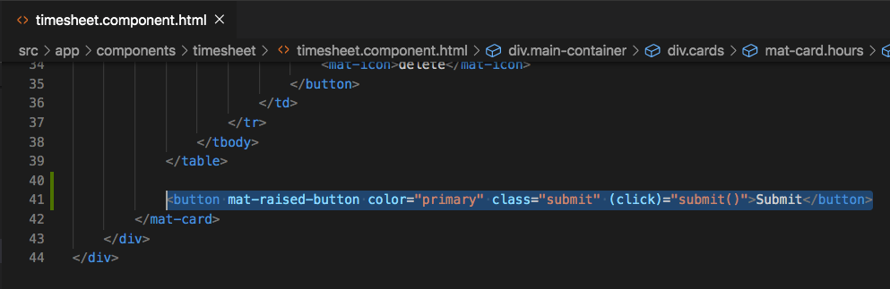
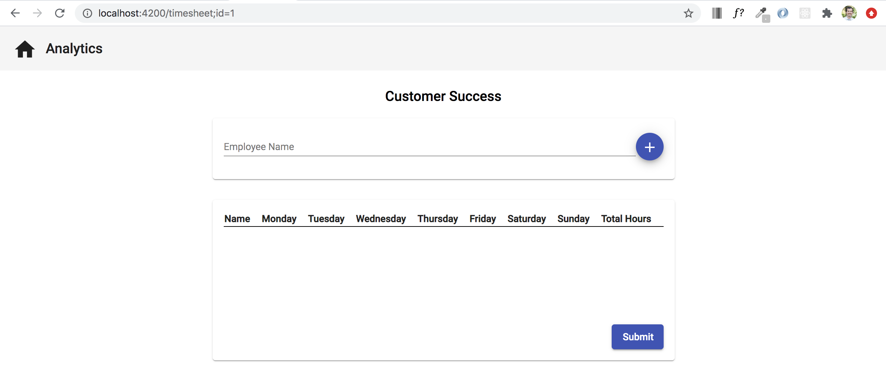
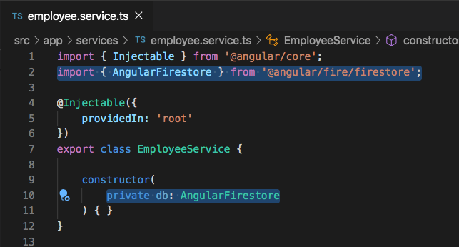
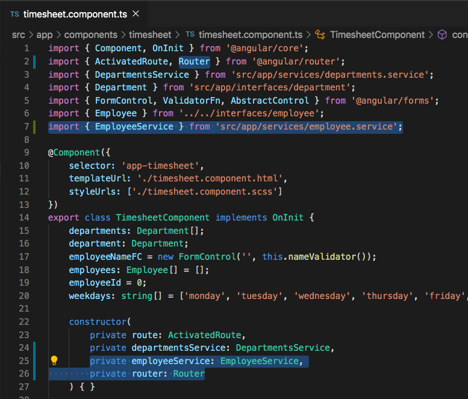

# Saving to Firebase


Now that we have Firebase configured into our application, let's work on saving data to our database.

The first thing that we want to do is be able to submit the hours that have been entered for each employee in the `TimesheetComponent`. Go to the `timesheet.component.html` file and past the following code directly below the `</table>`.

`<button mat-raised-button color="primary" class="submit" (click)="submit()">Submit</button>`



Also add the following style to the `timesheet.compnent.scss` file

```
.submit {
    width: 75px;
    margin-left: auto;
    margin-top: 15px;
}
```




Soon our `./timesheet` route will look like the image above. With the `<button>` html that we added, there is a `(click)` event that is trying to call a `submit()` function that doesn't yet exist, let's get to that now. 

When we click the `submit` button, we want employee data to be saved to Firebase. Because the future saving and retrieving of firebase data will revolve around employee data, let's create an `EmployeeService`. Use the command `ng g s services/employee` to generate a new service within the `services` folder. 

Now that we've created the `EmployeeService`, let's add three methods that will allow us to `save` a new employee, `update` existing employee information, and `delete` any employee information that we no longer want.

In order for us to alter data in our Firestore database, we must first inject `AngularFirestore` into the constructor of the `EmployeeService`. Don't forget the `import { AngularFirestore } from '@angular/fire/firestore';` at the top of the service.




Our next step is to create methods that will allow us to save and update employee information. Paste the following code below the constructor in the `employee.service.ts` file. Don't forget to also import the `Employee` interface into the service.

```
saveEmployeeHours(employee: Employee): any {
    this.db.collection('employee-hours').add(employee);
}
```

To explain the methods above in a little more detail, the `saveEmployeeHours(employee: Employee)` method accepts a parameter named `employee` which is of type `Employee`. Within that method, we are referencing `this.db` which is the `AngularFirestore` injection, calling the `.collection('employee-hours')` property which creates a referece to the `emloyee-hours` collection sense we are passing in `'employee-hours'` to `.collection()`, and then finally we are calling `.add(employee)` which is actually posting the `employee` parameter to the `employee-hours` collection.

At this point you may be thinking "where is the employee-hours collection, we haven't created one yet", and that is correct, we haven't created that collection, but if that collection doesn't exist and we try and save to it, Firebase automatically will create it for us.

<!-- The `updateEmployeeHours(employee: Employee)` method also accepts a parameter named `employee`. Within that method we are doing similar logic to the `saveEmployeeHours` method, but instead of calling `.add()`, we are calling `.doc()`, which expects a document id to find the current document to update. After we call `.doc()`, we then call `.set()` which makes the actual update to the firebase document. -->

Now that we have created a save method in our service, let's also create a method in our `timesheet.component.ts` file that can call these methods in our service once the employee clicks the `submit` button.

First, inject the `EmployeeService` and `Router` into the `timesheet.component.ts` file.

`import { EmployeeService } from '../../services/employee.service';`

`private employeeService: EmployeeService`

Also add the `Router` to the already existing import at the top of the page next to `ActivatedRoute`




Add the following code to the `timesheet.component.ts` file, just below the `deleteEmployee()` function that already exists.

```
submit(): void {
    this.employees.forEach(employee => {
        this.employeeService.updateEmployeeHours(employee);
    });

    this.router.navigate(['./departments']);
}
```

<!-- At this point, when the user clicks the `Submit` button at the bottom of the `./timesheet` page, this newly created `submit()` function will be called. Within the `submit()` function, we are looping through each employee and performing logic. If the employee has an id, that means that we have already saved the employee once before and we are just wanting to update this employee information using `updateEmployeeHours()`. If the employee doesn't have an id, then we are wanting to save the data as information for a new employee but using the `saveEmployeeHours()` method. Finally, after each employee information has been saved or updated, we want to route back to the `./departments` page. -->

At this point, when the user clicks the `Submit` button at the bottom of the `./timesheet` page, this newly created `submit()` function will be called. Within the `submit()` function, we are looping through each employee and calling the the `saveEmployeeHours()` method. After each employee information has been saved, we want to route back to the `./departments` page using `this.router.navigate(['./departments'])`.


## Acceptance Test

After having saved data by clicking the `Submit` button, check in your `Cloud Firestore` database to see if there is an `employee-hours` collection with documents containing the information that you were trying to save.


