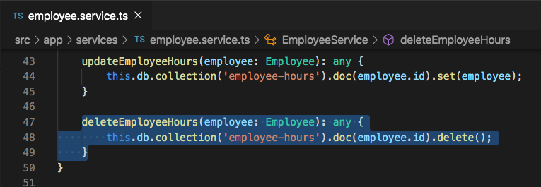

# Deleting Firestore Document

## Introduction

The last CRUD operation that we will be implementing in our application is the `Delete` operation.


## Deleting a Document

In the `TimesheetComponent` we provide a trash can icon that allows to remove the user from the UI, but it is only temporary and the employee data will appear again once the page or app is reloaded. To actually remove the employee information from Firestore, let's create that method in the `EmployeeService`. Add the following code to the `employee.service.ts` file below the `updateEmployeeHours` function.

```
deleteEmployeeHours(employee: Employee): any {
    this.db.collection('employee-hours').doc(employee.id).delete();
}
```



This method is similar to the update method where we find the `collection` reference, then the `doc` reference, but then after that we call `.delete()` to delete the document within the `employee-hours` collection that has the id we from the `employee` parameter that we passed into the `deleteEmployeeHours()` function.


In the `timesheet.component.ts` file replace the `deleteEmployee()` function with the following code.

```
deleteEmployee(employee: Employee, index: number): void {
    if (employee.id) {
        this.employeeService.deleteEmployeeHours(employee);
    }

    this.employees.splice(index, 1);
}
```

In the `timesheet.component.html` file, update the `deleteEmployee()` click event to be `(click)="deleteEmployee(employee, i)"`


## Acceptance Test

Click the trash can icon and make see that the employee data was deleted. Check the `employee-hours` collection to see that it was delete from there as well.


## Congratulations your timesheet application is now complete!