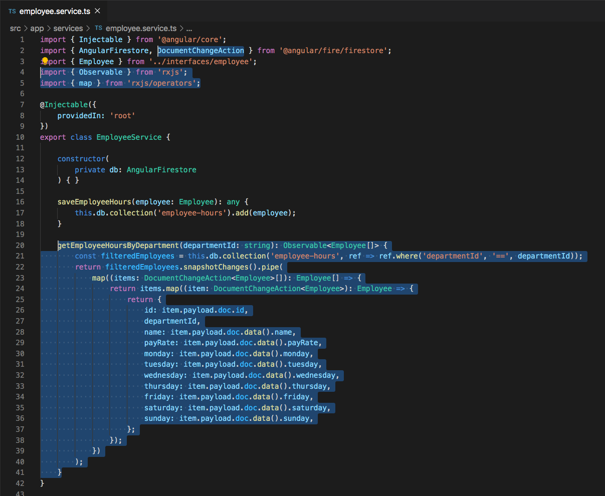
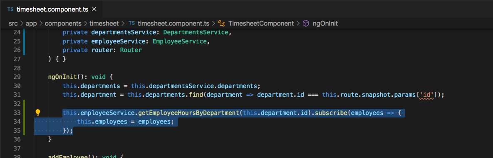
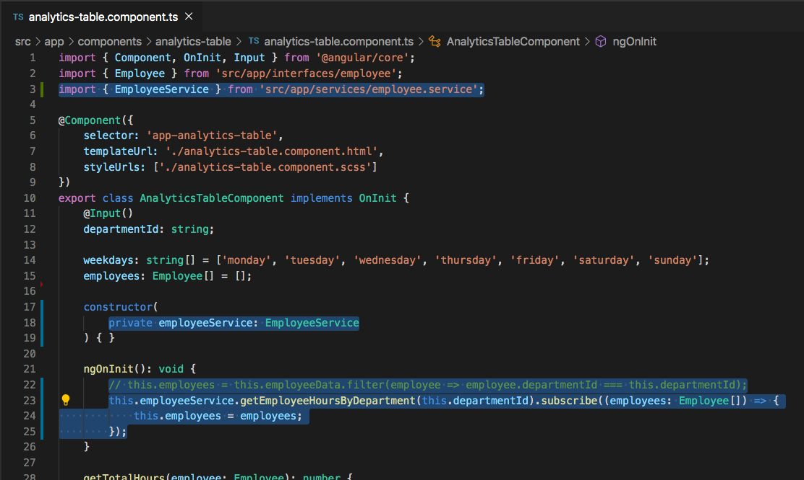

# Querying Firestore Collections

## Introduction

In the previous section we were able to successfully save employee information to the Firestore, and even though we were able to see the data in the Firebase console, we had no way of viewing that data in our application. In this section we will be querying the `employee-hours` collection depending on what department we are trying to view.


## Querying Data By Department

In the `employee.service.ts` file, paste the following code below the `saveEmployeeHours()` method.

```
getEmployeeHoursByDepartment(departmentId: string): Observable<Employee[]> {
    const filteredEmployees = this.db.collection('employee-hours', ref => ref.where('departmentId', '==', departmentId));
    return filteredEmployees.snapshotChanges().pipe(
        map((items: DocumentChangeAction<Employee>[]): Employee[] => {
            return items.map((item: DocumentChangeAction<Employee>): Employee => {
                return {
                    id: item.payload.doc.id,
                    departmentId,
                    name: item.payload.doc.data().name,
                    payRate: item.payload.doc.data().payRate,
                    monday: item.payload.doc.data().monday,
                    tuesday: item.payload.doc.data().tuesday,
                    wednesday: item.payload.doc.data().wednesday,
                    thursday: item.payload.doc.data().thursday,
                    friday: item.payload.doc.data().friday,
                    saturday: item.payload.doc.data().saturday,
                    sunday: item.payload.doc.data().sunday,
                };
            });
        })
    );
}
```

Don't forget the `Observable`, `DocumentChangeAction` and `map` imports

```
import { Observable } from 'rxjs';
import { map } from 'rxjs/operators';
```



Let's walk through the `getEmployeeHoursByDepartment(departmentId: string)` function above, because this is what contains our firestore collection query. In the `getEmployeeHoursByDepartment(departmentId: string)` we are first passing in a `departmentId` which is of type `string` as a parameter. We are expecting this function to return us an `Observable` which is of type `Employee[]`.

The very first line in the function is where we perform the query, `const filteredEmployees = this.db.collection('employee-hours', ref => ref.where('departmentId', '==', departmentId));`. Here we are creating a variable called `filteredEmployees` and setting it equal to reference of the `employee-hours` collection where the documents in that collection have a `departmentId` that is equal to (`==`) the `departmentId` parameter that we passed into the original function. After we have the `filteredEmployees` variable set, we then call `snapshotChanges` which is a firestore method that allows us to perform additional logic when a value is returned, in this case when the query for filtered employees returns a value.

When the `snapshotChanges()` returns a value, we then perform a `map` operator which allows us to change the data that we are receiving and return it back as a new observable. The reason why we want to change it is so that we can now set the employee `id` property equal to the `id` of the firestore document rather than the counter that we were manually setting before implementing Firebase. To populate each property of the employee document we are calling `item.payload.doc.data()` and then the property name. Pay close attention to the `.data()`, this is actually calling a method to retrieve a value rather than just referencing a property value. In the end we should be returning a list of employee data with the `id` property equaling the firestore document `id`.


With this new query function created, let's go to `timesheet.component.ts` file and make use of it. Paste the following code at the bottom of the `ngOnInit` of the `timesheet.component.ts` file.

```
this.employeeService.getEmployeeHoursByDepartment(this.department.id).subscribe(employees => {
    this.employees = employees;
});
```




## Acceptance Test


When on the departments page, select the department that you had previously saved data for. Now you should see that data being displayed in the UI. Because of the `getEmployeeHoursByDepartment()` code that we just added to the `timesheet.component.ts` file, when the `TimesheetComponent` is initialized, we are now retrieving the employee information straight from the Firestore and then displaying it in our application.


## Refactor AnalyticsTableComponent

Previously in the `AnalyticsTableComponent` we were just displaying fake employee data that we had copied into the file. Let's go ahead and refactor this code a little bit so that we are displaying data from `employee-hours` collection instead.

Follow the next steps in order in the `analytics-table.component.ts` file:
1. Inject the `EmployeeService` into the constructor.
```
constructor(
    private employeeService: EmployeeService
) { }
```

Don't forget the import at the top of the page.
`import { EmployeeService } from 'src/app/services/employee.service';`

2. Comment out `this.employees = this.employeeData.filter(employee => employee.departmentId === this.departmentId);` code that is currently inside of the `ngOnInit`

3. Paste the following code inside of the `ngOnInit`
```
this.employeeService.getEmployeeHoursByDepartment(this.departmentId).subscribe((employees: Employee[]) => {
    this.employees = employees;
});
```




## Acceptance Test

When you navigate to the `./analytics` route and select the department tab that you had originally entered data for, you should now see data from Firestore instead of the static data we were usign before.