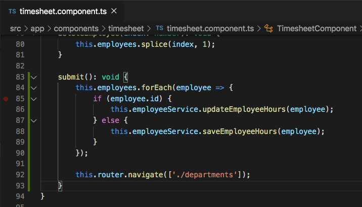

# Updating Firestore Document

## Introduction

So far with Firestore we have introduced saving and querying, now we will walk though how to update an already existing record.


## Updating a Document

In the `employee.service.ts` file add the following code below the `getEmployeeHoursByDepartment` function.

```
updateEmployeeHours(employee: Employee): any {
    this.db.collection('employee-hours').doc(employee.id).set(employee);
}
```

In this function we are finding the reference to the collection we want to update using `this.db.collection('employee-hours')`, then we find the reference to the document we want to update by calling `.doc(employee.id)` where we are passing in the id of the employee we want to update, and then finally we call `.set(employee)` to set that document equal to the employee object that we passed in as a parameter to the `updateEmployeeHours(employee: Employee)` function.

Now that we have created that method in our service, let's go ahead and call it within the `timesheet.component.ts` file. Update the `submit()` function to the code below.

```
submit(): void {
    this.employees.forEach(employee => {
        if (employee.id) {
            this.employeeService.updateEmployeeHours(employee);
        } else {
            this.employeeService.saveEmployeeHours(employee);
        }
    });

    this.router.navigate(['./departments']);
}
```




As you can see in the code above, we've  updated the logic depending on if the employee that are currently looping through has an id or not. If the employee does have an id, then we're calling the `updateEmployeeHours()` method, if the employee doesn't have an id, then we're calling the `saveEmployeeHours()` method. This logic will help us determine when an employee should be updated and when it should be saved as a new record.


## Acceptance Test

Go to the `./timesheeet` page of a department that you had already entered data for. Alter some of the data and click `Submit`. Check in your Firestore database that the data has been altered. Also look at the `./analytics` page for that department to show that the data changes are being reflected.